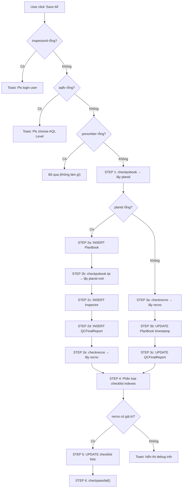

# Phân Tích Chi Tiết: `Btnsaveall_Click`

> **Source:** [MainActivity.cs](file:///D:/QCFINAL_Fast/Inspection_Fast_CTQ/Inspection_Fast/MainActivity.cs#L3380-L3494)
> **Mục đích:** Lưu toàn bộ dữ liệu inspection (PlanBook + Report + Checklist status) và kiểm tra Pass/Fail.

---

## Tổng Quan Luồng Xử Lý



---

## Danh Sách Biến Class-Level Được Sử Dụng

Tất cả các biến sau đều là **class field** (khai báo tại [dòng 99-104](file:///D:/QCFINAL_Fast/Inspection_Fast_CTQ/Inspection_Fast/MainActivity.cs#L99-L104)):

| Biến | Kiểu | Gán giá trị khi nào | Mô tả |
|:---|:---|:---|:---|
| `inspectorid` | `string` | Login thành công (dòng 3838) | Mã nhân viên QC |
| `inspectorname` | `string` | Login thành công (dòng 3837) | Tên inspector |
| `factory` | `string` | Login thành công (dòng 3836) | Mã nhà máy |
| `aqllv` | `string` | Click nút AQL (Regular/Japan/100%) | Mức AQL đã chọn |
| `ponumber` | `string` | Chọn PO từ dialog search | Mã PO |
| `planref` | `string` | Chọn PO từ dialog search (dòng 3578) | PlanRefNo |
| `planid` | `string` | Gán bởi `checkpobook` trong luồng Save | PlanID từ DB |
| `recno` | `string` | Gán bởi `checkrecno` trong luồng Save | Record Number từ DB |
| `samplesize` | `string` | Chọn PO (gọi `checksamplesize`, dòng 3585) | Kích thước mẫu |
| `listcheck1` | `List<int>` | Default `{0..26}`, load từ DB nếu có | Trạng thái tổng hợp Conform |
| `listcheck2` | `List<int>` | Load từ DB nếu có | Trạng thái Supplier Signature |
| `listcheck3` | `List<int>` | Load từ DB nếu có | Trạng thái Production Status |
| `listgenadd` | `List<int>` | Tính từ `listcheck1` | General checklist subset |
| `listcheckadd` | `List<int>` | Tính từ `listcheck1` | Checklist subset |
| `listcheckcartonadd` | `List<int>` | Tính từ `listcheck1` | Carton checklist subset |

> [!NOTE]
> Biến `txtctnnumber`, `edinspecqty`, `txttotalqty`, `edsearchpo` là các **UI controls** (TextView / EditText), giá trị lấy qua `.Text`.

---

## Chi Tiết Từng Câu SQL

### SQL #1 — `checkpobook` (Stored Procedure)

```sql
exec DtradeProduction.dbo.QCFinal 'checkpobook', @ponumber, @factory, @inspectorid, @planref, '', ''
```

| Param vị trí | Biến C# | Có giá trị? | Ghi chú |
|:---|:---|:---|:---|
| Param 2 | `ponumber` | ✅ Có | Đã validate `!string.IsNullOrEmpty` ở trên |
| Param 3 | `factory` | ✅ Có | Gán khi login |
| Param 4 | `inspectorid` | ✅ Có | Đã validate ở trên |
| Param 5 | `planref` | ⚠️ Có thể rỗng | Gán khi chọn PO, nhưng không validate |
| Param 6–7 | `''` (trống) | — | Không sử dụng |

**Kết quả trả về:** `planid` — PlanID nếu đã tồn tại PlanBook, hoặc rỗng nếu chưa.

> [!WARNING]
> Câu SQL này được gọi **3 lần** trong cùng hàm (dòng 3389, 3396, 3432). Lần thứ 3 ở dòng 3432 nằm **ngoài khối if/else chính**, nên luôn chạy dù các validation trước đó có fail hay không. Điều này có thể gây crash nếu `ponumber`, `factory`, `inspectorid` vẫn đang rỗng.

---

### SQL #2 — INSERT `InlineFGsWHPlanBook` (Direct Query)
> Chỉ chạy khi `planid` rỗng (tạo mới PlanBook)

```sql
INSERT INTO DtradeProduction.dbo.InlineFGsWHPlanBook 
  (Factory, PONo, ShipNo, AQLPlan, AQLSample, AQLCTN, Status, CreatedBy, SysCreateDate, PlanDate, JobNo) 
VALUES 
  (@factory, @ponumber, '1', @aqllv, @samplesize, @cartonCount, 'Book', @inspectorid, getdate(), getdate(), @planref)
```

| Column | Biến C# | Có giá trị? | Ghi chú |
|:---|:---|:---|:---|
| `Factory` | `factory` | ✅ | |
| `PONo` | `ponumber` | ✅ | |
| `ShipNo` | `'1'` | ⚠️ Hardcoded | Luôn là `'1'`, không dynamic |
| `AQLPlan` | `aqllv` | ✅ | Đã validate |
| `AQLSample` | `samplesize` | ⚠️ Có thể rỗng | Gán khi chọn PO nhưng nếu SP trả rỗng sẽ bị `""` |
| `AQLCTN` | `txtctnnumber.Text.Split('\|').Length` | ✅ | Tính động từ UI |
| `Status` | `'Book'` | — | Fix cứng |
| `CreatedBy` | `inspectorid` | ✅ | |
| `PlanDate` | `getdate()` | — | SQL Server tự generate |
| `JobNo` | `planref` | ⚠️ | Có thể rỗng nếu search PO thiếu |

---

### SQL #3 — INSERT `InlineFGsWHInspector` (Direct Query)
> Chỉ chạy khi vừa tạo mới PlanBook thành công

```sql
INSERT INTO DtradeProduction.dbo.InlineFGsWHInspector 
  (PlanID, Inspector, InsQty) 
VALUES 
  (@planid, @inspectorid, @txttotalqty)
```

| Column | Biến C# | Có giá trị? | Ghi chú |
|:---|:---|:---|:---|
| `PlanID` | `planid` | ✅ | Vừa lấy từ `checkpobook` |
| `Inspector` | `inspectorid` | ✅ | |
| `InsQty` | `txttotalqty.Text` | ⚠️ Có thể `""` | Nếu UI chưa bind thì rỗng |

---

### SQL #4 — INSERT `QCFinalReport` (Direct Query)
> Tạo bản ghi report lần đầu

```sql
INSERT INTO DtradeProduction.dbo.QCFinalReport 
  (PlanID, InsDate, Inspector, CartonNum, InsQTY, Accpected, Rejected, SysCreateDate) 
VALUES 
  (@planid, getdate(), @inspectorid, @txtctnnumber, @edinspecqty, @edinspecqty, '0', getdate())
```

| Column | Biến C# | Có giá trị? | Ghi chú |
|:---|:---|:---|:---|
| `PlanID` | `planid` | ✅ | |
| `Inspector` | `inspectorid` | ✅ | |
| `CartonNum` | `txtctnnumber.Text` | ✅ | Chuỗi `"1\|6\|12\|18..."` |
| `InsQTY` | `edinspecqty.Text` | ✅ | |
| `Accpected` | `edinspecqty.Text` | ❌ **Logic issue** | Gán = InsQTY, chưa trừ rejected |
| `Rejected` | `'0'` | — | Fix cứng = 0 |

> [!IMPORTANT]
> Khi **tạo mới** report lần đầu, `Accepted = InsQTY` và `Rejected = 0` là hợp lý vì chưa có lỗi.
> Vấn đề chỉ phát sinh ở câu UPDATE (SQL #7) bên dưới.

---

### SQL #5 — `checkrecno` (Stored Procedure)

```sql
exec DtradeProduction.dbo.QCFinal 'checkrecno', @planid, @inspectorid, '', '', '', ''
```

| Param | Biến C# | Có giá trị? |
|:---|:---|:---|
| Param 2 | `planid` | ✅ |
| Param 3 | `inspectorid` | ✅ |

**Kết quả trả về:** `recno` — Record number vừa tạo hoặc đã tồn tại.

---

### SQL #6 — UPDATE `InlineFGsWHPlanBook` (Direct Query)
> Chỉ chạy khi `planid` đã tồn tại (cập nhật)

```sql
UPDATE DtradeProduction.dbo.InlineFGsWHPlanBook 
SET SysCreateDate = getdate() 
WHERE PlanID = @planid
```

| Biến | Có giá trị? | Ghi chú |
|:---|:---|:---|
| `planid` | ✅ | Vừa lấy từ `checkpobook` |

✅ **Không có vấn đề** — chỉ cập nhật timestamp.

---

### SQL #7 — UPDATE `QCFinalReport` (Direct Query)
> Chỉ chạy khi `planid` đã tồn tại (cập nhật report)

```sql
UPDATE DtradeProduction.dbo.QCFinalReport 
SET InsDate = getdate(), 
    InsQTY = @edinspecqty, 
    Accpected = @edinspecqty 
WHERE RecNo = @recno
```

| Column | Biến C# | Có giá trị? | Ghi chú |
|:---|:---|:---|:---|
| `InsQTY` | `edinspecqty.Text` | ✅ | |
| `Accpected` | `edinspecqty.Text` | ❌ **BUG** | Ghi đè = InsQTY, bỏ qua Rejected đã có |
| `RecNo` | `recno` | ✅ | |

> [!CAUTION]
> **BUG nghiêm trọng:** Mỗi lần user bấm Save All, cột `Accpected` bị reset lại = `InsQTY`, hoàn toàn xóa sạch kết quả tính toán `Accepted - Rejected` trước đó. Nếu user đã ghi nhận defect (làm giảm `Accepted`, tăng `Rejected`), khi bấm Save All sẽ **đảo ngược** tất cả.
>
> **Thiếu cập nhật:** Cột `CartonNum` **KHÔNG** được update trong trường hợp này.

---

### SQL #8 — UPDATE `QCFinalReport` Checklist (Direct Query)
> Chạy sau khi phân loại checklist, chỉ khi `recno` có giá trị

```sql
UPDATE DtradeProduction.dbo.QCFinalReport 
SET GeneralList    = @listgenadd,
    CheckList      = @listcheckadd,
    Measurment     = @listcheck1,
    SupplierSignature = @listcheck2,
    ProductionStatus  = @listcheck3 
WHERE RecNo = @recno
```

| Column | Biến C# | Kiểu dữ liệu | Có giá trị? | Ghi chú |
|:---|:---|:---|:---|:---|
| `GeneralList` | `listgenadd` | `string.Join("\|", ...)` | ✅ | Subset từ `listcheck1` (index < 9) |
| `CheckList` | `listcheckadd` | `string.Join("\|", ...)` | ✅ | Subset từ `listcheck1` (index > 9) |
| `Measurment` | `listcheck1` | `string.Join("\|", ...)` | ✅ | Danh sách đầy đủ conform indexes |
| `SupplierSignature` | `listcheck2` | `string.Join("\|", ...)` | ⚠️ Có thể rỗng | Chỉ có giá trị nếu user đã click N/A |
| `ProductionStatus` | `listcheck3` | `string.Join("\|", ...)` | ⚠️ Có thể rỗng | Chỉ có giá trị nếu user đã click Pending |
| `RecNo` | `recno` | `string` | ✅ | |

---

### SQL #9 + #10 — `checkpassfail()` (Gọi 2 câu SQL liên tiếp)
> Phương thức riêng tại [dòng 2355-2369](file:///D:/QCFINAL_Fast/Inspection_Fast_CTQ/Inspection_Fast/MainActivity.cs#L2355-L2369)

**Câu 1 — Trigger updatestatus:**
```sql
exec QCFinal 'updatestatus', @edsearchpo, '', '', '', '', ''
```

| Param | Biến | Có giá trị? | Ghi chú |
|:---|:---|:---|:---|
| Param 2 | `edsearchpo.Text` | ✅ | PO number từ ô search |

**Câu 2 — Đọc kết quả status:**
```sql
SELECT Status FROM DtradeProduction.dbo.InlineFGsWHPlanBook WHERE PlanID = @planid
```

| Biến | Có giá trị? |
|:---|:---|
| `planid` | ✅ |

**Kết quả:** Nếu `Status = 'F'` → giao diện highlight FAIL đỏ. Ngược lại → highlight PASS xanh.

---

## Bảng Logic Phân Loại Checklist (Dòng 3429–3458)

Dữ liệu từ `listcheck1` (mảng các index conform) được phân tách thành 3 nhóm con:

```
listcheck1 indexes: [0, 1, 2, 3, 4, 5, 6, 7, 8, 9, 10, 11, 12, ... 26]
                     ├─── General (0-8) ──────┤├─ Carton (9-10) ┤├─── Checklist (10+) ──┤
```

| Điều kiện | List đích | Phép biến đổi | Ý nghĩa |
|:---|:---|:---|:---|
| `t1 < 9` | `listgenadd` | `t1 + 1` | General inspection items (9 mục) |
| `t1 > 8 && t1 < 11` | `listcheckcartonadd` | `t1 - 7` | Carton check items (2 mục) |
| `t1 > 9` | `listcheckadd` | `t1 - 9` | Product checklist items (17 mục) |

> [!NOTE]
> `listcheckcartonadd` hiện tại **không được lưu vào DB** (code đã bị comment out ở dòng 3464-3486). Nó từng dùng cho QCFinalMoisture nhưng đã bỏ.

---

## Tổng Hợp Vấn Đề Cần Giải Quyết Khi Migrate

### ❌ BUG — Accepted bị reset khi Update

| Vấn đề | Vị trí | Severity |
|:---|:---|:---|
| `Accpected = edinspecqty.Text` khi UPDATE | SQL #7, dòng 3414 | 🔴 **Critical** |

**Giải pháp:** Khi update, phải tính lại:
```sql
Accpected = InsQTY - (SELECT ISNULL(SUM(Major), 0) FROM QCFinalDefImg WHERE RecNo = @recno)
```

### ❌ THIẾU — CartonNum không update khi đã có report

| Vấn đề | Vị trí | Severity |
|:---|:---|:---|
| `CartonNum` không có trong UPDATE | SQL #7, dòng 3414 | 🟡 **Medium** |

**Giải pháp:** Thêm `CartonNum = @txtctnnumber` vào câu UPDATE.

### ⚠️ RISK — `checkpobook` gọi ngoài khối validate

| Vấn đề | Vị trí | Severity |
|:---|:---|:---|
| Dòng 3432 gọi `checkpobook` mà không check `ponumber`, `factory`, `inspectorid` | Dòng 3432 | 🟡 **Medium** |

**Giải pháp:** Di chuyển vào bên trong khối `if (!string.IsNullOrEmpty(ponumber))`, hoặc thêm guard check.

### ⚠️ RISK — ShipNo hardcoded

| Vấn đề | Vị trí | Severity |
|:---|:---|:---|
| `ShipNo = '1'` luôn | SQL #2 | 🟢 **Low** |

**Giải pháp:** Nếu business chỉ dùng 1 shipment thì OK. Nếu có nhiều đợt giao hàng thì cần tham số hóa.

---

## Bảng Mapping Biến C# → Web API

Khi triển khai lên QCFinal_Web, các biến cần được map từ đâu:

| Biến C# (Legacy) | Nguồn trên Web | Lưu ở đâu |
|:---|:---|:---|
| `inspectorid` | `getInspectorId_api(userId)` | `poInfo.inspectorId` |
| `factory` | Login response / AppStore | `useAppStore.factory` |
| `aqllv` | UI selector (chưa implement) | `poInfo.aqllv` |
| `ponumber` | `poInfo.poNumber` | `useAppStore.poInfo` |
| `planref` | `poInfo.planRefNo` | `useAppStore.poInfo` |
| `planid` | `getPlanId_api(...)` | `poInfo.planId` |
| `recno` | `getRecNo_api(...)` | `poInfo.recNo` |
| `samplesize` | `checksamplesize` SP | `poInfo.sampleSize` |
| `txtctnnumber.Text` | `poInfo.CartonNum` | `useAppStore.poInfo` |
| `edinspecqty.Text` | `poInfo.InsQTY` / input field | `useAppStore.poInfo` |
| `txttotalqty.Text` | `poInfo.totalQty` | `useAppStore.poInfo` |
| `listcheck1/2/3` | Checklist state | `useAppStore.checklistStatuses` |

---

## Thứ Tự Thực Thi Hoàn Chỉnh (10 bước)

| Bước | Hành động | SQL | Kết quả |
|:---|:---|:---|:---|
| 1 | Validate `inspectorid`, `aqllv`, `ponumber` | — | Guard clause |
| 2 | Kiểm tra PlanBook đã tồn tại | `checkpobook` SP | → `planid` |
| 3a | *Nếu chưa có:* Tạo PlanBook | `INSERT InlineFGsWHPlanBook` | Tạo plan mới |
| 3b | Lấy lại `planid` | `checkpobook` SP lần 2 | → `planid` |
| 3c | Gán inspector | `INSERT InlineFGsWHInspector` | — |
| 3d | Tạo report | `INSERT QCFinalReport` | — |
| 3e | Lấy recno | `checkrecno` SP | → `recno` |
| 4a | *Nếu đã có:* Lấy recno | `checkrecno` SP | → `recno` |
| 4b | Cập nhật timestamp | `UPDATE InlineFGsWHPlanBook` | — |
| 4c | Cập nhật report | `UPDATE QCFinalReport` | ⚠️ Bug Accepted |
| 5 | Lấy lại planid (lần 3) | `checkpobook` SP | → confirm `planid` |
| 6 | Phân loại checklist indexes | In-memory | 3 sub-lists |
| 7 | Cập nhật checklist vào DB | `UPDATE QCFinalReport` (lists) | 5 cột checklist |
| 8 | Trigger update status | `QCFinal 'updatestatus'` | Tính toán Pass/Fail |
| 9 | Đọc kết quả | `SELECT Status FROM InlineFGsWHPlanBook` | → `'F'` hoặc khác |
| 10 | Cập nhật UI | — | Highlight xanh/đỏ |
