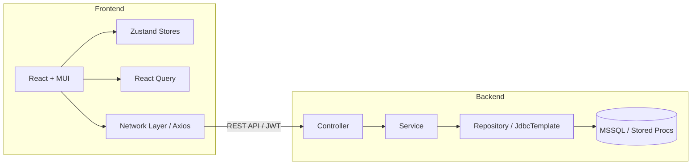
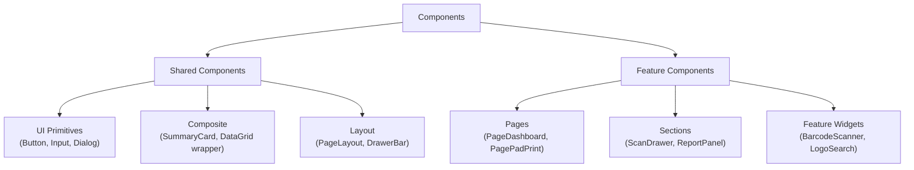
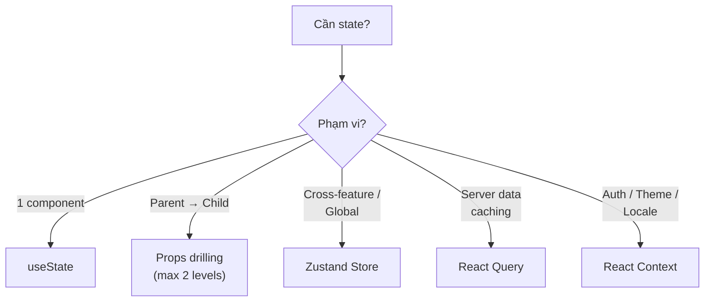
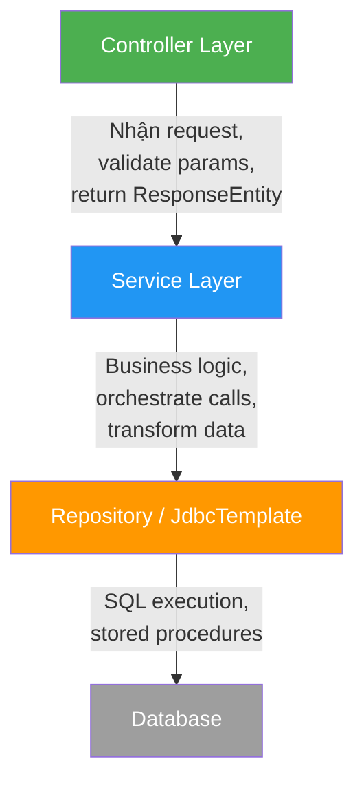
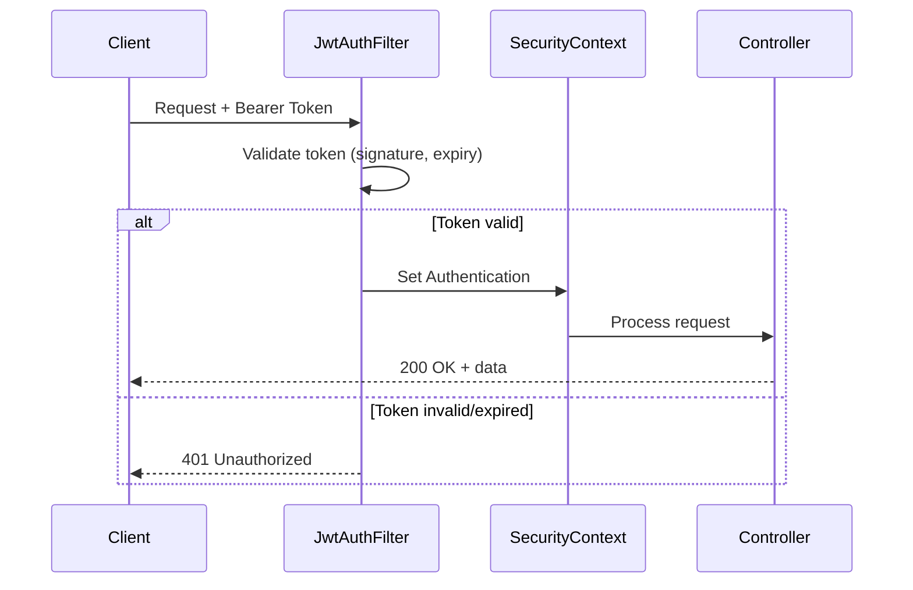

# 📐 Coding Standards — DecorationScanOutput

> **Phiên bản**: 1.0 · **Cập nhật**: 2026-04-18  
> **Stack**: React 18 + TypeScript + MUI 5 + Zustand · Java 17 + Spring Boot 3.2 + MSSQL

---

## Mục lục

1. [Tổng quan kiến trúc](#1-tổng-quan-kiến-trúc)
2. [Frontend — Qui tắc chung](#2-frontend--qui-tắc-chung)
3. [Frontend — Theme & Màu sắc](#3-frontend--theme--màu-sắc)
4. [Frontend — Design Tokens (Border, Radius, Spacing)](#4-frontend--design-tokens)
5. [Frontend — Component Architecture](#5-frontend--component-architecture)
6. [Frontend — Zustand State Management](#6-frontend--zustand-state-management)
7. [Frontend — Dialog & Notification System](#7-frontend--dialog--notification-system)
8. [Frontend — Network Layer & API](#8-frontend--network-layer--api)
9. [Backend — Kiến trúc & Qui tắc chung](#9-backend--kiến-trúc--qui-tắc-chung)
10. [Backend — Multi-User & Scalability](#10-backend--multi-user--scalability)
11. [Backend — Security](#11-backend--security)
12. [Backend — Error Handling & Logging](#12-backend--error-handling--logging)
13. [Git Conventions](#13-git-conventions)
14. [Code Review Checklist](#14-code-review-checklist)

---

## 1. Tổng quan kiến trúc



> [!IMPORTANT]
> **Nguyên tắc cốt lõi**: Mỗi layer chỉ giao tiếp với layer liền kề. Frontend không bao giờ gọi trực tiếp DB logic. Backend không bao giờ chứa UI logic.

---

## 2. Frontend — Qui tắc chung

### 2.1 Cấu trúc thư mục

```
src/
├── components/          # ✅ Shared/reusable UI components
│   ├── Dialog/          # Dialog variants
│   ├── DataGrid/        # DataGrid wrappers
│   ├── Field/           # Form field components
│   ├── Layout/          # Layout structures
│   ├── Loading/         # Loading states
│   ├── SummaryCards/    # Dashboard cards
│   └── constants/       # App-wide constants (version, etc.)
├── features/            # ✅ Feature-based modules
│   ├── auth/
│   ├── dashboard/
│   ├── padprint/
│   ├── embroidery/
│   └── shared/          # Cross-feature shared logic
├── hooks/               # ✅ Custom hooks (grouped by feature)
│   ├── app/             # App-level hooks
│   ├── feature_shared/  # Cross-feature hooks
│   └── feature_<name>/  # Feature-specific hooks
├── network/             # ✅ API layer (axios, urls)
├── routers/             # ✅ Route definitions
├── utils/               # ✅ Utilities, contexts, stores
│   ├── context/         # React Context Providers
│   ├── states/          # Zustand stores
│   └── i18n/            # Internationalization
└── assets/              # Static files
```

### 2.2 Quy tắc đặt tên

| Loại | Convention | Ví dụ |
|------|-----------|-------|
| **Component file** | PascalCase | `DialogWarning.tsx`, `SummaryCards.tsx` |
| **Hook file** | camelCase, prefix `use` | `useAppStore.ts`, `useActiveTimeTracker.ts` |
| **Store file** | camelCase, prefix `use...Store` | `useScanDataStore.ts`, `useAppStore.ts` |
| **Utility file** | camelCase | `storage.ts`, `debounce.ts` |
| **API file** | camelCase, suffix `_api` | `machine_api.ts`, `auth_api.ts` |
| **Feature page** | PascalCase, prefix `Page` | `PageLogin.tsx`, `PagePadPrint.tsx` |
| **Sub-component** | PascalCase, prefix theo context | `ScanDrawer.tsx`, `ReportPanel.tsx` |
| **Type/Interface** | PascalCase, NO prefix `I` | `BarcodeItem`, `LogoItem`, `AppState` |

### 2.3 Quy tắc Import

```typescript
// ✅ THỨ TỰ IMPORT (từ trên xuống)
// 1. React / library imports
import React, { useState, useMemo } from 'react';
import { Box, Typography } from '@mui/material';

// 2. Internal shared components
import DialogFullScreen from '@components/Dialog/Dialog';
import { ScreenLoaderBackdrop } from '@components/Loading/ScreenLoaderBackdrop';

// 3. Feature-specific imports
import { useScanDataStore } from '@/utils/states/useScanDataStore';

// 4. Type imports
import type { BarcodeItem } from '@/utils/states/useScanDataStore';

// 5. Styles (nếu có)
import './PageDashboard.css';
```

> [!TIP]
> Luôn dùng **path alias** `@/`, `@components/` thay vì relative path dài `../../..`.

### 2.4 TypeScript Rules

```typescript
// ❌ TRÁNH: any type
const data: any = response;

// ✅ ĐÚNG: Define interface rõ ràng
interface MachineData {
    McID: string;
    factory?: string;
}
const data: MachineData = response;

// ❌ TRÁNH: Inline type
const handler = (e: { target: { value: string } }) => {};

// ✅ ĐÚNG: Named type
type InputChangeHandler = React.ChangeEvent<HTMLInputElement>;
const handler = (e: InputChangeHandler) => {};
```

> [!WARNING]
> **Cấm dùng `any`** ngoại trừ khi tương tác với legacy API trả về dynamic schema. Nếu bắt buộc phải dùng, thêm comment `// TODO: type this properly` và tạo task refactor.

---

## 3. Frontend — Theme & Màu sắc

### 3.1 Hệ thống Color Token

Dự án sử dụng **custom theme tokens** extended từ MUI Theme. Mọi màu sắc **PHẢI** reference từ theme, **TUYỆT ĐỐI KHÔNG** hardcode màu trong component.

#### Color Palette Structure

```typescript
theme.color = {
    primary: {    // Brand greens — dùng cho CTA, active states
        o1  → o10  // Nhạt → đậm
    },
    neutral: {    // Grays — dùng cho text phụ, border, background
        o1  → o10  // Trắng → đen
    },
    text: {       // Text colors — mode-aware (light/dark)
        o1  → o15
    },
    background: { // Background colors — mode-aware (light/dark)
        o1  → o15
    }
}
```

#### Bảng màu chi tiết & Mục đích sử dụng

| Token | Light Mode | Dark Mode | Mục đích |
|-------|-----------|-----------|----------|
| `color.primary.o5` | `#39B54A` | — | **Brand chính**, primary buttons |
| `color.primary.o6` | `#27A338` | — | **Hover state** cho primary |
| `color.primary.o7` | `#1C982D` | — | **Active/pressed** state |
| `color.neutral.o1` | `#FFFFFF` | — | Card backgrounds |
| `color.neutral.o3` | `#D2D6DE` | — | Borders, dividers |
| `color.neutral.o5` | `#989FB0` | — | Placeholder text |
| `color.text.o1` | `#1B2722` | `#FFFFFF` | **Text chính** |
| `color.text.o4` | `#E6352B` | `#FF6B5E` | **Error / destructive** |
| `color.text.o6` | `#0D891E` | `#18A32A` | **Success text** |
| `color.background.o1` | `#FFFFFF` | `#101316` | **Page background**  |
| `color.background.o2` | `#F5F5F9` | `#2B2B30` | **Section background** |
| `color.background.o6` | `#27A338` | `#1E7C2D` | **Green highlights** |

### 3.2 Cách sử dụng màu trong Component

```typescript
// ✅ ĐÚNG: Lấy màu từ theme
<Typography sx={{ color: (theme) => theme.color.text.o1 }}>
    Main text
</Typography>

<Box sx={{ backgroundColor: (theme) => theme.color.background.o2 }}>
    Section content
</Box>

// ✅ ĐÚNG: Dùng với useTheme hook
const theme = useTheme();
const borderColor = theme.color.neutral.o3;

// ❌ SAI: Hardcode màu
<Typography sx={{ color: '#1B2722' }}>Hardcoded</Typography>
<Box sx={{ backgroundColor: '#F5F5F9' }}>Bad</Box>
```

### 3.3 Semantic Color Mapping

Để đảm bảo consistency, tuân theo quy tắc **semantic color** sau:

| Ngữ cảnh | Token phải dùng |
|----------|----------------|
| **Success** (thành công) | `color.text.o6` cho text, `color.background.o9` cho bg |
| **Error** (lỗi) | `color.text.o4` cho text |
| **Warning** (cảnh báo) | `color.text.o2` |
| **Info** (thông tin) | `color.text.o3` |
| **Primary action** | `color.primary.o5` → `palette.primary.main` |
| **Disabled state** | `color.neutral.o3` bg, `color.neutral.o5` text |
| **Body text** | `color.text.o1` |
| **Secondary text** | `color.text.o12` |
| **Divider / Border** | `color.neutral.o3` hoặc `color.background.o5` |

### 3.4 Dark Mode

- MUI Theme đã xử lý tự động via `mode === 'light' ? ... : ...` trong `ThemeContextProvider`
- Component code **KHÔNG CẦN** check dark mode — chỉ dùng theme tokens
- Toggle: `useThemeContext().toggleMode()`

---

## 4. Frontend — Design Tokens

### 4.1 Border

| Token | Giá trị | Sử dụng |
|-------|--------|---------|
| **border-none** | `none` | Card, elevated surfaces (dùng shadow thay vì border) |
| **border-light** | `1px solid` + `theme.color.neutral.o3` | Input fields, table cells |
| **border-medium** | `2px solid` + `theme.color.neutral.o3` | Buttons (outlined variant) |
| **border-focus** | `2px solid` + `theme.color.primary.o5` | Input focus state |
| **border-error** | `2px solid` + `theme.color.text.o4` | Validation error |
| **border-divider** | `1px solid` + `theme.color.background.o5` | Section dividers |

```typescript
// ✅ Chuẩn hóa border
const BORDER = {
    light:  (theme: Theme) => `1px solid ${theme.color.neutral.o3}`,
    medium: (theme: Theme) => `2px solid ${theme.color.neutral.o3}`,
    focus:  (theme: Theme) => `2px solid ${theme.color.primary.o5}`,
    error:  (theme: Theme) => `2px solid ${theme.color.text.o4}`,
    divider:(theme: Theme) => `1px solid ${theme.color.background.o5}`,
} as const;
```

### 4.2 Border Radius

| Token | Giá trị | Sử dụng |
|-------|--------|---------|
| `radius.none` | `0px` | DataGrid cells, inline elements |
| `radius.sm` | `4px` | **Buttons**, input fields, chips |
| `radius.md` | `8px` | **Cards**, dialog corners |
| `radius.lg` | `12px` | Summary cards, large panels |
| `radius.xl` | `16px` | Modal overlays, floating panels |
| `radius.pill` | `9999px` | Tags, badges, pill buttons |

```typescript
// ✅ Sử dụng chuẩn
const RADIUS = {
    none: '0px',
    sm:   '4px',    // buttons, inputs
    md:   '8px',    // cards
    lg:   '12px',   // panels
    xl:   '16px',   // modals
    pill: '9999px', // pills/badges
} as const;

// Ví dụ
<Button sx={{ borderRadius: RADIUS.sm }}>Submit</Button>
<Card sx={{ borderRadius: RADIUS.md }}>Card content</Card>
```

### 4.3 Spacing

Dựa trên **8px grid system** (MUI theme.spacing default = 8px):

| MUI Spacing | Pixels | Sử dụng |
|-------------|--------|---------|
| `0.5` | 4px | Micro-gap (icon ↔ text) |
| `1` | 8px | Compact padding (cells, chips) |
| `1.5` | 12px | Small gaps between elements |
| `2` | 16px | **Standard padding** cho containers |
| `3` | 24px | Section spacing |
| `4` | 32px | Large section gaps |
| `5` | 40px | Page margins |

```typescript
// ✅ ĐÚNG: Dùng theme.spacing
<Box sx={{ p: 2, gap: 1.5 }}>
    <TextField sx={{ mb: 1 }} />
</Box>

// ❌ SAI: Hardcode pixel value
<Box sx={{ padding: '16px', gap: '12px' }}>
```

### 4.4 Typography

```typescript
// Chuẩn typography
typography: {
    fontFamily: 'Inter, sans-serif',
    fontSize: 14,  // Base size
}

// Qui tắc size
// Page title:   24px, fontWeight: 600
// Section title: 18px, fontWeight: 600
// Card title:   16px, fontWeight: 600
// Body text:    14px, fontWeight: 400
// Caption:      12px, fontWeight: 400
// Button:       14px, fontWeight: 700, textTransform: 'none'
```

### 4.5 Elevation & Shadows

| Level | Style | Sử dụng |
|-------|-------|---------|
| **elevation-0** | No shadow | Flat surfaces, table rows |
| **elevation-1** | `0px 1px 3px rgba(0,0,0,0.08)` | Cards, dropdowns |
| **elevation-2** | `0px 4px 6px rgba(0,0,0,0.1)` | Floating panels, autocomplete paper |
| **elevation-3** | `0px 8px 16px rgba(0,0,0,0.12)` | Modals, dialogs |

### 4.6 Interactive Element Minimum Sizes

| Element | Min Height | Min Width |
|---------|-----------|-----------|
| **Button** | `48px` | `120px` (action), `162px` (dialog) |
| **Input** | `48px` | — |
| **Touch target** (mobile) | `44px` | `44px` |

---

## 5. Frontend — Component Architecture

### 5.1 Phân loại Component



### 5.2 Component Template

```typescript
// ✅ Component chuẩn
import React, { memo } from 'react';
import { Box, Typography } from '@mui/material';
import type { Theme } from '@mui/material/styles';

// ── Types ────────────────────────────────────────────
interface SummaryCardProps {
    title: string;
    value: number;
    variant?: 'default' | 'success' | 'warning';
    onClick?: () => void;
}

// ── Component ────────────────────────────────────────
const SummaryCard: React.FC<SummaryCardProps> = memo(({ 
    title, 
    value, 
    variant = 'default',
    onClick 
}) => {
    return (
        <Box
            onClick={onClick}
            sx={{
                p: 2,
                borderRadius: '8px',  // RADIUS.md
                border: (theme) => `1px solid ${theme.color.neutral.o3}`,
                backgroundColor: (theme) => theme.color.background.o1,
                cursor: onClick ? 'pointer' : 'default',
                transition: 'all 0.2s ease',
                '&:hover': onClick ? {
                    boxShadow: '0px 4px 6px rgba(0,0,0,0.1)',
                    transform: 'translateY(-1px)',
                } : undefined,
            }}
        >
            <Typography 
                sx={{ 
                    fontSize: '12px', 
                    color: (theme) => theme.color.text.o12 
                }}
            >
                {title}
            </Typography>
            <Typography 
                sx={{ 
                    fontSize: '24px', 
                    fontWeight: 600, 
                    color: (theme) => theme.color.text.o1 
                }}
            >
                {value.toLocaleString()}
            </Typography>
        </Box>
    );
});

SummaryCard.displayName = 'SummaryCard';
export default SummaryCard;
```

### 5.3 Quy tắc Component

| Quy tắc | Mô tả |
|---------|--------|
| **memo() cho list items** | Bọc `React.memo()` cho components render trong list/loop |
| **displayName** | Luôn set `displayName` cho `memo()` / `forwardRef()` components |
| **Single Responsibility** | Mỗi component chỉ làm 1 việc. Page > 300 dòng → tách sub-components |
| **Props Interface** | Mỗi component phải có interface Props riêng, đặt ngay trên component |
| **Default Props** | Dùng destructuring defaults, không dùng `defaultProps` (deprecated) |
| **No inline styles** | Dùng `sx` prop. Nếu logic phức tạp → extract thành `const styles = { ... }` |
| **Event handler naming** | `handle<Action>` cho internal, `on<Action>` cho props callback |

### 5.4 Page Component Pattern

```typescript
// ✅ Feature page pattern
// File: features/padprint/PagePadPrint.tsx
const PagePadPrint: React.FC = () => {
    // 1. Hooks (stores, contexts)
    const { selectedMachine } = useAppStore();
    const { scanResults } = useScanDataStore();
    
    // 2. Local state (minimal — prefer Zustand)
    const [drawerOpen, setDrawerOpen] = useState(false);
    
    // 3. Derived/computed values
    const totalQty = useMemo(() => 
        scanResults.reduce((sum, item) => sum + item.QTY, 0),
        [scanResults]
    );
    
    // 4. Event handlers
    const handleScan = useCallback((barcode: string) => {
        // ...
    }, []);
    
    // 5. Render
    return (
        <PageLayout title="Pad Print">
            <SummarySection total={totalQty} />
            <ScanDrawer open={drawerOpen} onScan={handleScan} />
            <DataGridSection data={scanResults} />
        </PageLayout>
    );
};
```

---

## 6. Frontend — Zustand State Management

### 6.1 Khi nào dùng gì?



| Tool | Khi nào dùng |
|------|-------------|
| **`useState`** | State chỉ dùng trong 1 component (form input, toggle, modal open) |
| **Props** | Truyền data xuống 1-2 level con |
| **Zustand Store** | State dùng chung giữa nhiều feature (machines, scan data, shift) |
| **React Query** | Server state cần cache, refetch, stale-while-revalidate |
| **React Context** | App-wide configs: Auth, Theme, Locale, Loading |

### 6.2 Store Naming & File Convention

```
src/utils/states/
├── useAppStore.ts           # Machine, shift, server time
├── useScanDataStore.ts      # Barcode scanning state
├── useDailyReportStore.ts   # Daily report filters
├── useDowntimeReportStore.ts # Downtime report state
└── useHtSumOutputStore.ts   # HT summary output
```

> [!IMPORTANT]
> **Naming rule**: File = `use<Domain>Store.ts`, Export = `use<Domain>Store`

### 6.3 Store Structure Template

```typescript
import { create } from 'zustand';

// ── Types ────────────────────────────────────────────
// Luôn define interface riêng cho state
interface ScanDataState {
    // ▸ State fields
    barcodeNumber: string;
    scanResults: BarcodeItem[];
    selectedBarcodes: BarcodeItem[];
    
    // ▸ Actions (setter functions)
    setBarcodeNumber: (barcode: string) => void;
    setScanResults: (results: BarcodeItem[] | ((prev: BarcodeItem[]) => BarcodeItem[])) => void;
    setSelectedBarcodes: (barcodes: BarcodeItem[] | ((prev: BarcodeItem[]) => BarcodeItem[])) => void;
    
    // ▸ Computed / Derived (getters)
    getFormattedLogosForDB: () => Record<string, string[]>;
    
    // ▸ Bulk actions
    clearAllScanData: () => void;
}

// ── Store ────────────────────────────────────────────
export const useScanDataStore = create<ScanDataState>((set, get) => ({
    // Initial values
    barcodeNumber: '',
    scanResults: [],
    selectedBarcodes: [],
    
    // Setters — hỗ trợ cả value lẫn updater function
    setBarcodeNumber: (barcode) => set({ barcodeNumber: barcode }),
    setScanResults: (updater) => set((state) => ({
        scanResults: typeof updater === 'function' 
            ? updater(state.scanResults) 
            : updater
    })),
    
    // Derived from current state — dùng get()
    getFormattedLogosForDB: () => {
        const state = get();
        // ... compute logic
        return result;
    },
    
    // Reset
    clearAllScanData: () => set({
        barcodeNumber: '',
        scanResults: [],
        selectedBarcodes: [],
    }),
}));
```

### 6.4 Zustand Best Practices

```typescript
// ✅ ĐÚNG: Select chỉ field cần → tránh re-render
const barcodeNumber = useScanDataStore(s => s.barcodeNumber);
const setBarcodeNumber = useScanDataStore(s => s.setBarcodeNumber);

// ❌ SAI: Destructure toàn bộ → component re-render khi BẤT KỲ field thay đổi
const { barcodeNumber, scanResults, selectedBarcodes } = useScanDataStore();

// ✅ ĐÚNG: Nhóm nhiều field liên quan bằng shallow comparison
import { useShallow } from 'zustand/react/shallow';

const { scanResults, selectedBarcodes } = useScanDataStore(
    useShallow(s => ({
        scanResults: s.scanResults,
        selectedBarcodes: s.selectedBarcodes,
    }))
);
```

> [!CAUTION]
> **Không lưu derived state vào store**. Nếu `totalQty = scanResults.reduce(...)`, dùng `useMemo` trong component thay vì store field.

### 6.5 Store không nên chứa

| ❌ Không lưu | Lý do | ✅ Thay thế |
|-------------|-------|------------|
| UI-only state (modal open, tab index) | Chỉ có 1 component cần | `useState` |
| Server cache data | Cần invalidation, refetch | React Query |
| Theme / Auth context | Cần Provider tree | React Context |
| Form input values | Ephemeral, component-local | `useState` hoặc react-hook-form |

---

## 7. Frontend — Dialog & Notification System

### 7.1 Dialog Types & Khi nào dùng

| Component | Mục đích | Size | Ví dụ |
|-----------|---------|------|-------|
| `Dialog` | **Form/Create** — nhập liệu | `md` – `lg` | Create barcode, edit output |
| `DialogFullScreen` | **Complex form** — nhiều sections | `lg` – `xl` | Import logo, bulk scan |
| `ConfirmDialog` | **Xác nhận hành động** | `xs` – `sm` | "Bạn chắc chắn muốn submit?" |
| `DialogWarning` | **Cảnh báo** — chỉ read | `xs` – `sm` | "Barcode đã scan rồi" |
| `DialogDelete` | **Xóa / Destructive** | `sm` | "Xóa record #123?" |
| `GlobalDialog` | **System-level** popup | `sm` | Session expired |
| `GlobalSnackbar` | **Toast notification** | auto | Success/error sau API calls |

### 7.2 Dialog Button Standards

```typescript
// ✅ Dialog button chuẩn
const DIALOG_BUTTON_STYLE = {
    width: '162px',
    px: 2,
    py: 1,
    height: '48px',
    borderWidth: '2px',
    borderRadius: '4px',
    fontWeight: 700,
};

// Button colors
// Cancel:  color='#5E697C', borderColor='#5E697C', variant='outlined'
// Confirm: color='white', backgroundColor='primary', variant='contained'
// Danger:  color='white', backgroundColor='#E6352B', variant='contained'
```

### 7.3 Dialog Layout Pattern

```typescript
// ✅ Cấu trúc chuẩn cho mọi dialog
<Dialog maxWidth="md" fullWidth>
    {/* Header — sticky top */}
    <Toolbar sx={{ backgroundColor: theme.color.background.o2 }}>
        <Typography sx={{ fontSize: '24px', fontWeight: 600 }}>
            {title}
        </Typography>
    </Toolbar>
    <Divider sx={{ borderColor: theme.color.background.o5 }} />
    
    {/* Content — scrollable */}
    <DialogContent sx={{ 
        height: '50vh', 
        overflowY: 'auto', 
        backgroundColor: theme.color.background.o2 
    }}>
        {children}
    </DialogContent>
    
    {/* Footer — sticky bottom */}
    <Divider />
    <DialogActions sx={{ 
        position: 'sticky', 
        bottom: 0, 
        backgroundColor: theme.color.background.o2 
    }}>
        <CancelButton onClick={onClose}>Cancel</CancelButton>
        <SubmitButton onClick={onSubmit}>Submit</SubmitButton>
    </DialogActions>
</Dialog>
```

### 7.4 GlobalSnackbar (Toast) Convention

```typescript
// Cách trigger toast từ bất kỳ đâu
import { toast } from '@/utils/states/state';

// Success
toast.value = { 
    ...toast.value, 
    message: 'Saved successfully!', 
    severity: 'success' 
};

// Error
toast.value = { 
    ...toast.value, 
    message: 'Failed to save', 
    severity: 'error' 
};

// ✅ Qui tắc:
// - Success toast: auto-dismiss sau 3s
// - Error toast: cần user dismiss
// - Warning toast: auto-dismiss sau 5s
// - Toast KHÔNG dùng cho confirmations, dùng ConfirmDialog
```

---

## 8. Frontend — Network Layer & API

### 8.1 API File Structure

```
src/network/
├── network.ts         # Axios client, interceptors, base config
├── environment.ts     # Environment-specific configs
└── urls/
    ├── auth_api.ts
    ├── machine_api.ts
    └── factory_api.ts
```

### 8.2 API Function Template

```typescript
// ✅ Chuẩn API function
// File: network/urls/machine_api.ts

import { request } from '@/network/network';

/**
 * Load report data for a specific machine, date, shift and user.
 */
export const getLoadReport_api = (
    machine: string,
    date: string,
    shiftType: string,
    userCode: string
) => {
    return request({
        url: '/machine/load-report',
        method: 'GET',
        params: { machine, date, shiftType, userCode },
    });
};

/**
 * Insert heat transfer records (batch).
 * @param items Array of barcode scan data to insert
 */
export const insertHeatTransfer_api = (items: InsertHTPayload[]) => {
    return request({
        url: '/machine/insert-heat-transfer',
        method: 'POST',
        data: items,
    });
};
```

### 8.3 API Naming Convention

| Action | Prefix | Ví dụ |
|--------|--------|-------|
| **GET** (fetch data) | `get<Entity>_api` | `getLoadReport_api` |
| **POST** (create) | `insert<Entity>_api` | `insertHeatTransfer_api` |
| **PUT** (update) | `update<Entity>_api` | `updateLogo_api` |
| **DELETE** | `delete<Entity>_api` | `deleteOutput_api` |
| **POST** (action) | `exec<Action>_api` | `execScanBarcode_api` |

### 8.4 Error Handling Flow

```typescript
// ✅ Chuẩn error handling trong component
try {
    const result = await getLoadReport_api(machine, date, shift, user);
    // Handle success
    toast.value = { ...toast.value, message: t('success'), severity: 'success' };
} catch (error) {
    // error đã là string message (từ network.ts onError)
    toast.value = { ...toast.value, message: String(error), severity: 'error' };
}
```

> [!NOTE]
> **401 Unauthorized** được xử lý tự động bởi `network.ts` → set `isExpired: true` → show `SessionExpiredDialog`.

---

## 9. Backend — Kiến trúc & Qui tắc chung

### 9.1 Package Structure

```
com.trax.skillmeasurement/
├── SkillMeasurementApplication.java    # Entry point
├── config/
│   ├── SecurityConfig.java             # Spring Security + CORS
│   └── OpenApiConfig.java              # Swagger/OpenAPI
├── controller/
│   ├── AuthController.java             # /auth/*
│   ├── MachineController.java          # /machine/*
│   └── FactoryController.java          # /factory/*
├── service/
│   ├── AuthService.java
│   ├── MachineService.java
│   └── FactoryService.java
├── repository/                          # (Future: tách DB logic)
├── dto/
│   └── ApiResponse.java                # Standard response wrapper
├── filter/
│   └── JwtAuthFilter.java             # JWT authentication filter
├── model/                              # Entity / POJO classes
└── util/                               # Utility classes
```

### 9.2 Layer Responsibilities



| Layer | Trách nhiệm | KHÔNG được làm |
|-------|-------------|---------------|
| **Controller** | Parse request, validate input, return `ResponseEntity<ApiResponse<T>>` | Chứa business logic, gọi DB trực tiếp |
| **Service** | Business logic, orchestrate repository calls, data transformation | Biết về HTTP, return ResponseEntity |
| **Repository** | Execute SQL/stored procedures, map ResultSet | Chứa business logic |
| **DTO** | Data transfer objects giữa layers | Chứa logic |

### 9.3 Controller Pattern

```java
// ✅ Controller chuẩn
@RestController
@RequestMapping("/machine")
public class MachineController {

    private final MachineService machineService;

    // ✅ Constructor injection (KHÔNG dùng @Autowired field injection)
    public MachineController(MachineService machineService) {
        this.machineService = machineService;
    }

    // ✅ GET — query data
    @GetMapping("/shift")
    public ResponseEntity<ApiResponse<List<Map<String, Object>>>> getShift(
            @RequestParam String machine) {
        return ResponseEntity.ok(
            ApiResponse.success(machineService.getShift(machine))
        );
    }

    // ✅ POST — mutation with try-catch
    @PostMapping("/insert-heat-transfer")
    public ResponseEntity<ApiResponse<List<Map<String, Object>>>> insertHeatTransfer(
            @RequestBody List<Map<String, String>> items) {
        try {
            List<Map<String, Object>> results = machineService.insertHeatTransfer(items);
            return ResponseEntity.ok(ApiResponse.success(results));
        } catch (Exception e) {
            return ResponseEntity.internalServerError()
                .body(ApiResponse.error(500, e.getMessage()));
        }
    }
}
```

### 9.4 ApiResponse Wrapper

```java
// Mọi API response PHẢI wrap trong ApiResponse
@Data
public class ApiResponse<T> {
    private int code;
    private String message;
    private T data;

    public static <T> ApiResponse<T> success(T data) {
        ApiResponse<T> resp = new ApiResponse<>();
        resp.code = 200;
        resp.message = "Success";
        resp.data = data;
        return resp;
    }

    public static <T> ApiResponse<T> error(int code, String message) {
        ApiResponse<T> resp = new ApiResponse<>();
        resp.code = code;
        resp.message = message;
        resp.data = null;
        return resp;
    }
}
```

### 9.5 Service Pattern

```java
@Service
public class MachineService {
    private static final Logger log = LoggerFactory.getLogger(MachineService.class);
    private final JdbcTemplate jdbcTemplate;

    public MachineService(JdbcTemplate jdbcTemplate) {
        this.jdbcTemplate = jdbcTemplate;
    }

    // ✅ Qui tắc method:
    // 1. Log input params ở đầu method
    // 2. Wrap toàn bộ trong try-catch
    // 3. Return empty collection thay vì null
    // 4. SET NOCOUNT ON cho stored procedures

    public List<Map<String, Object>> getShift(String machine) {
        log.info("getShift: machine={}", machine);
        try {
            return jdbcTemplate.queryForList(
                "SET NOCOUNT ON; EXEC DtradeProduction.dbo.HTloadshift ?",
                machine
            );
        } catch (Exception e) {
            log.error("Failed to load shift for machine: {}", machine, e);
            return new ArrayList<>();  // ✅ KHÔNG return null
        }
    }
}
```

### 9.6 Stored Procedure Convention

```java
// ✅ Luôn dùng SET NOCOUNT ON để tránh row count interfere
"SET NOCOUNT ON; EXEC DtradeProduction.dbo.<ProcedureName> ?, ?, ?"

// ✅ Dùng parameterized queries — KHÔNG BAO GIỜ string concat
// ❌ SAI
"EXEC MyProc '" + param1 + "', '" + param2 + "'"
// ✅ ĐÚNG  
"SET NOCOUNT ON; EXEC MyProc ?, ?", param1, param2

// ✅ Multi-result set → dùng ConnectionCallback
jdbcTemplate.execute((ConnectionCallback<Object>) con -> {
    CallableStatement cs = con.prepareCall("{call ProcName(?, ?)}");
    cs.setString(1, param1);
    cs.setString(2, param2);
    boolean hasResults = cs.execute();
    // Process result sets...
    return null;
});
```

---

## 10. Backend — Multi-User & Scalability

### 10.1 Connection Pool (HikariCP)

```yaml
# application.yml — PRODUCTION settings
spring:
  datasource:
    hikari:
      # ── Pool sizing ──
      maximum-pool-size: 30          # Max concurrent DB connections
      minimum-idle: 10               # Keep 10 idle connections ready
      idle-timeout: 300000           # Close idle after 5 min
      max-lifetime: 1800000          # Recycle connections every 30 min
      connection-timeout: 20000      # Wait max 20s for connection
      
      # ── Leak detection ──
      leak-detection-threshold: 60000  # Warn if connection held > 60s
      
      # ── Validation ──
      validation-timeout: 5000
      connection-test-query: SELECT 1
```

> [!WARNING]
> **Công thức sizing pool**: `pool_size = (core_count * 2) + disk_spindles`.  
> Cho server 4-core: `(4 * 2) + 1 = 9` → round up to **10-15** cho development, **20-30** cho production.

### 10.2 Stateless Architecture

```java
// ✅ Spring Security — STATELESS (không tạo HTTP session)
.sessionManagement(session -> 
    session.sessionCreationPolicy(SessionCreationPolicy.STATELESS)
)

// ✅ KHÔNG dùng:
// - HttpSession
// - @SessionScope beans
// - Session-based CSRF (đã disable vì dùng JWT)
```

### 10.3 Caching Strategy

```java
// ✅ Server time cache — giảm 90% DB calls
@Service
public class MachineService {
    private volatile String cachedTime;
    private volatile String cachedDate;
    private volatile long lastTimeFetch = 0;
    private static final long TIME_CACHE_MS = 5000; // 5 seconds

    public Map<String, String> getServerTime() {
        long now = System.currentTimeMillis();
        if (now - lastTimeFetch < TIME_CACHE_MS && cachedTime != null) {
            return Map.of("time", cachedTime, "date", cachedDate);
        }
        // Fetch from DB and update cache...
    }
}
```

> [!TIP]
> **Candidate cho caching**:
> - `getServerTime()` → cache 5s (frequency cao, data ít thay đổi)
> - `getDowntimeList()` → cache 30s (static lookup data)
> - `getMachines()` → cache 60s (ít thay đổi)
> - **KHÔNG cache**: Scan results, insert operations, reports (realtime data)

### 10.4 Thread Safety Rules

```java
// ✅ ĐÚNG: volatile cho simple cache fields
private volatile String cachedTime;

// ✅ ĐÚNG: Service beans là singleton → KHÔNG lưu request-specific state
@Service
public class MachineService {
    // ❌ SAI: mutable instance field
    private String currentUser;  // RACE CONDITION!
    
    // ✅ ĐÚNG: pass as method params
    public void someMethod(String currentUser) { ... }
}

// ✅ ĐÚNG: JdbcTemplate thread-safe → inject bình thường
private final JdbcTemplate jdbcTemplate; // Thread-safe
```

### 10.5 Performance Optimization

| Optimization | Áp dụng |
|-------------|---------|
| **SET NOCOUNT ON** | Mọi stored procedure call → giảm network traffic |
| **Connection pooling** | HikariCP default → đã tối ưu |
| **Batch operations** | Insert nhiều records → pass List, loop trong service |
| **Async post-processing** | `HTearn`, `HTwk` calls có thể chuyển sang `@Async` |
| **Response compression** | Spring Boot default GZIP cho response > 2KB |
| **Limit result size** | Thêm `TOP N` cho queries trả về nhiều rows |

### 10.6 Async Processing (Khuyến nghị)

```java
// Cho các stored proc post-processing (HTearn, HTwk) 
// không cần chờ result

@Async
@Service
public class PostProcessService {
    
    @Async
    public CompletableFuture<Void> execHTearn(String date, String user, String shift) {
        jdbcTemplate.update("SET NOCOUNT ON; EXEC HTearn ?, ?, ?, ?",
            date, user, "", shift);
        return CompletableFuture.completedFuture(null);
    }
}

// Cần thêm @EnableAsync vào Application class:
@SpringBootApplication
@EnableAsync
public class SkillMeasurementApplication { ... }
```

---

## 11. Backend — Security

### 11.1 JWT Authentication Flow



### 11.2 Security Rules

| Rule | Áp dụng |
|------|---------|
| **STATELESS sessions** | Không dùng HTTP session — chỉ JWT |
| **CORS whitelist** | Dùng `allowedOriginPatterns` — production nên restrict |
| **CSRF disabled** | Vì stateless + JWT, CSRF không cần |
| **Public endpoints** | Chỉ: `/auth/login`, `/auth/logout`, `/swagger-ui/**` |
| **Password hashing** | BCrypt (Spring Security default) |
| **Token expiry** | Access token: 8-12h (theo shift), Refresh: 7d |
| **Sensitive logging** | KHÔNG log passwords, tokens, personal data |

### 11.3 Input Validation

```java
// ✅ Validate tại Controller level
@GetMapping("/shift")
public ResponseEntity<ApiResponse<?>> getShift(@RequestParam String machine) {
    if (machine == null || machine.isBlank()) {
        return ResponseEntity.badRequest()
            .body(ApiResponse.error(400, "Machine is required"));
    }
    // Parameterized query → SQL injection safe
    return ResponseEntity.ok(ApiResponse.success(
        machineService.getShift(machine.trim())
    ));
}

// ✅ Luôn trim() input strings
// ✅ Luôn dùng parameterized queries (?)
// ❌ KHÔNG string concat cho SQL
```

---

## 12. Backend — Error Handling & Logging

### 12.1 Logging Standards

```java
// ✅ SLF4J + Logback (Spring Boot default)
private static final Logger log = LoggerFactory.getLogger(MachineService.class);

// ── Log levels ──
log.debug("Detailed debug info: {}", detail);     // Dev only
log.info("Business event: machine={}", machine);   // Normal operations
log.warn("Potential issue: {}", warning);           // Non-critical issues
log.error("Failed operation: {}", msg, exception); // Errors with stacktrace

// ✅ Qui tắc log:
// 1. INFO: Mỗi public method entry → log input params
// 2. ERROR: Mỗi catch block → log error + exception object
// 3. WARN: Business rule violations (barcode đã scan, etc.)
// 4. DEBUG: Chi tiết SQL params (chỉ dev)
```

### 12.2 Error Handling Pattern

```java
// ✅ Service layer: catch + log + return safe default
public List<Map<String, Object>> getShift(String machine) {
    try {
        return jdbcTemplate.queryForList(...);
    } catch (Exception e) {
        log.error("Failed to load shift for machine: {}", machine, e);
        return new ArrayList<>();  // Safe default, không throw lên caller
    }
}

// ✅ Controller layer: catch → return error response
@PostMapping("/insert")
public ResponseEntity<ApiResponse<?>> insert(@RequestBody Data data) {
    try {
        var result = service.insert(data);
        return ResponseEntity.ok(ApiResponse.success(result));
    } catch (Exception e) {
        log.error("Insert failed", e);
        return ResponseEntity.internalServerError()
            .body(ApiResponse.error(500, "Insert failed: " + e.getMessage()));
    }
}
```

### 12.3 Những gì KHÔNG được log

```java
// ❌ TUYỆT ĐỐI KHÔNG LOG:
log.info("User password: {}", password);           // Passwords
log.info("Token: {}", jwtToken);                    // JWT tokens
log.info("User SSN: {}", personalData);            // Personal identifiers
log.info("Full request body: {}", requestBody);    // May contain sensitive data

// ✅ ĐÚNG:
log.info("Login attempt for user: {}", username);
log.info("Token validated for user: {}", userId);
```

---

## 13. Git Conventions

### 13.1 Commit Message Format

```
<type>(<scope>): <description>

[optional body]
```

| Type | Khi nào dùng | Ví dụ |
|------|-------------|-------|
| `feat` | Tính năng mới | `feat(padprint): add batch scan` |
| `fix` | Sửa lỗi | `fix(auth): handle token expiry` |
| `refactor` | Code refactor, không đổi behavior | `refactor(service): extract common SP logic` |
| `style` | Format, spacing, no logic change | `style: fix indentation` |
| `docs` | Documentation | `docs: update API readme` |
| `chore` | Build, deps, configs | `chore: update spring-boot to 3.2.6` |
| `perf` | Performance improvements | `perf(service): cache server time` |

### 13.2 Branch Strategy

```
main           ← Production-ready
├── dev        ← Development integration
│   ├── feat/padprint-batch-scan
│   ├── fix/session-expired-dialog
│   └── refactor/machine-service
```

---

## 14. Code Review Checklist

### Frontend
- [ ] Tất cả màu sắc reference từ `theme.color.*` — không hardcode hex
- [ ] Border radius dùng token chuẩn (4/8/12/16px)
- [ ] Zustand store: dùng selector, không destructure toàn bộ store
- [ ] Component > 300 dòng → cần tách
- [ ] Mọi `any` type đều có comment giải thích
- [ ] API functions follow naming convention `<verb><Entity>_api`
- [ ] Dialog dùng đúng variant (Confirm/Warning/FullScreen)
- [ ] `memo()` cho components trong lists
- [ ] Không có `console.log` còn sót

### Backend
- [ ] Constructor injection — không `@Autowired` field
- [ ] `SET NOCOUNT ON` cho mọi stored procedure
- [ ] Parameterized queries — không string concat SQL
- [ ] `log.info(...)` ở đầu mỗi public method
- [ ] Catch block luôn có `log.error(...)` với exception object
- [ ] Return empty collection, KHÔNG return `null`
- [ ] Sensitive data KHÔNG xuất hiện trong log
- [ ] Service methods không throw runtime exception lên controller
- [ ] `volatile` cho shared cache fields

---

> [!NOTE]
> Tài liệu này là **living document** — sẽ được cập nhật khi dự án phát triển. Mọi team member có trách nhiệm tuân thủ và đề xuất cải tiến.
