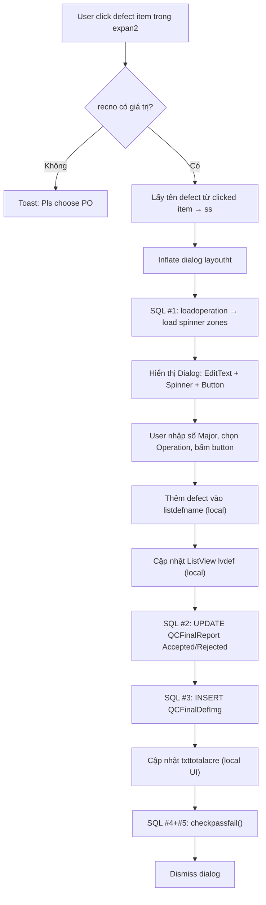
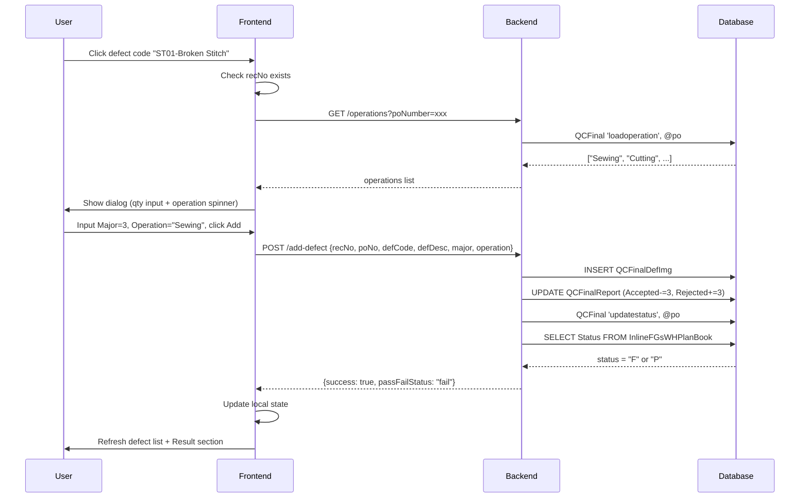

# Phân Tích Chi Tiết: `expan2.ChildClick` — Luồng Ghi Nhận Defect

> **Source:** [MainActivity.cs — dòng 332-414](file:///D:/QCFINAL_Fast/Inspection_Fast_CTQ/Inspection_Fast/MainActivity.cs#L332-L414)
> **Mục đích:** Khi user click vào 1 defect code trong danh sách (ExpandableListView), mở dialog nhập số lượng Major defect, chọn Operation, lưu vào DB và cập nhật Accepted/Rejected.

---

## Tổng Quan Luồng Xử Lý



---

## Phần 1: Nguồn Dữ Liệu — `LoadListviewdefect(expan2)`

> [Dòng 4332-4368](file:///D:/QCFINAL_Fast/Inspection_Fast_CTQ/Inspection_Fast/MainActivity.cs#L4332-L4368)

Trước khi phân tích ChildClick, cần hiểu **expan2 được nạp dữ liệu gì**. Hàm `LoadListviewdefect` chạy **lúc khởi tạo app** (dòng 315) và dùng 2 stored procedure:

### SQL Khởi Tạo #A — Lấy danh sách Defect Type (Header groups)

```sql
exec DtradeProduction.dbo.QCFinal 'load_DefectType', '', '', '', '', '', ''
```

| Param | Giá trị | Ghi chú |
|:---|:---|:---|
| Tất cả | `''` | Không cần tham số, lấy toàn bộ |

**Kết quả:** Danh sách tên nhóm lỗi (ví dụ: "Fabric", "Stitching", "Finishing", "Packing"...).
Được lưu vào `lsheader1` → hiển thị làm **Group headers** trên expan2.

### SQL Khởi Tạo #B — Lấy danh sách Defect Code cho mỗi nhóm

```sql
exec DtradeProduction.dbo.QCFinal 'load_DefectCode', @defectType, '', '', '', '', ''
```

| Param | Biến C# | Ghi chú |
|:---|:---|:---|
| Param 2 | `lsheader1[i]` | Tên nhóm lỗi từ query trên |

**Kết quả:** Danh sách mã lỗi (format `Code-Description`, ví dụ: `"ST01-Broken Stitch"`).
Được lưu vào `lsdtb1[defectType]` → hiển thị làm **Child items** bên dưới mỗi group.

> [!NOTE]
> Cấu trúc ExpandableListView:
> ```
> ▼ Fabric
>     FB01-Shade Variation
>     FB02-Stain
> ▼ Stitching
>     ST01-Broken Stitch
>     ST02-Skip Stitch
> ▼ ...
> ```

---

## Phần 2: `expan2.ChildClick` — Khi User Click Vào 1 Defect

### Bước 1: Guard Check (Dòng 334)

```csharp
if (!string.IsNullOrEmpty(recno))
```

Yêu cầu `recno` đã có giá trị → tức user **phải đã Save (Btnsave hoặc Btnsaveall)** trước đó để có RecNo trong DB.

Nếu `recno` rỗng → Toast `"Pls choose PO..."` (dòng 412).

### Bước 2: Lấy Tên Defect Từ Clicked Item (Dòng 336-337)

```csharp
LinearLayout ln = e1.ClickedView as LinearLayout;
string ss = ((TextView)ln.GetChildAt(0)).Text;
```

| Biến | Giá trị | Ví dụ |
|:---|:---|:---|
| `ss` | Chuỗi `Code-Description` | `"ST01-Broken Stitch"` |

> [!IMPORTANT]
> Biến `ss` sau đó được **parse bằng `LastIndexOf("-")`** để tách ra `DefCode` và `DefDescription`. Nếu Description chứa dấu `-` (ví dụ: `"ST01-Broken-Stitch"`) thì:
> - `DefCode` = `"ST01-Broken"` (sai!)
> - `DefDescription` = `"Stitch"` (thiếu!)
>
> Đây là **rủi ro tiềm ẩn** nếu defect description chứa dấu `-`.

### Bước 3: Inflate Dialog `layoutht` (Dòng 338-345)

Dialog gồm 3 control:

| Control | ID | Kiểu | Mục đích |
|:---|:---|:---|:---|
| `defma` | `editTextdefma` | EditText | Nhập số lượng Major defect |
| `btn` | `buttondefinput` | Button | Bấm để xác nhận |
| `sp` | `spinnerzonedef` | Spinner | Chọn Operation/Zone |

---

## Phần 3: Các Câu SQL Trong ChildClick

### SQL #1 — `loadoperation` (Stored Procedure) — Dòng 347

```sql
exec QCFinal 'loadoperation', @edsearchpo, '', '', '', '', ''
```

| Param | Biến C# | Có giá trị? | Ghi chú |
|:---|:---|:---|:---|
| Param 2 | `edsearchpo.Text` | ✅ | PO number từ ô search |

**Kết quả:** Cột `OPERATION` — danh sách các công đoạn sản xuất (ví dụ: "Sewing", "Cutting", "Packing"...).
Dùng để nạp vào **Spinner** cho user chọn Operation liên quan đến lỗi.

> [!NOTE]
> Spinner luôn có 1 phần tử rỗng `""` ở đầu (dòng 348: `zones.Add("")`), nên nếu user không chọn operation thì giá trị sẽ là chuỗi rỗng.

---

### SQL #2 — UPDATE `QCFinalReport` Accepted/Rejected — Dòng 382

```sql
UPDATE QCFinalReport 
SET Accpected = @newAccepted, 
    Rejected = @newRejected 
WHERE RecNo = @recno
```

| Biến | Công thức tính | Có giá trị? | Ghi chú |
|:---|:---|:---|:---|
| `@newAccepted` | `acre[0] - defma.Text` | ✅ | Accepted hiện tại trừ đi số Major mới |
| `@newRejected` | `acre[1] + defma.Text` | ✅ | Rejected hiện tại cộng thêm số Major mới |
| `@recno` | `recno` | ✅ | Đã validate ở guard |

**Logic tính toán:**
```
txttotalacre.Text = "50|0"  (ban đầu: 50 accepted, 0 rejected)
User nhập Major = 3
→ Accepted = 50 - 3 = 47
→ Rejected = 0 + 3 = 3
→ txttotalacre.Text = "47|3"
```

> [!TIP]
> Đây chính là phép tính **đúng logic nghiệp vụ**: `Accepted = InsQTY - Total Rejected`. Phép tính này ở đây hoạt động tốt vì nó dựa trên giá trị hiện tại (`acre[0]`, `acre[1]`) chứ không ghi đè mù quáng như bug trong `Btnsaveall_Click`.

---

### SQL #3 — INSERT `QCFinalDefImg` (Direct Query) — Dòng 386

```sql
INSERT INTO QCFinalDefImg 
  (RecNo, PONO, DefCode, DefDescription, Critical, Major, Minor, DefectiveUnit, SysCreateDate, Operation) 
VALUES 
  (@recno, @edsearchpo, @defCode, @defDescription, '0', @defma, '0', '0', getdate(), @operation)
```

| Column | Biến C# | Công thức | Có giá trị? | Ghi chú |
|:---|:---|:---|:---|:---|
| `RecNo` | `recno` | — | ✅ | |
| `PONO` | `edsearchpo.Text` | — | ✅ | |
| `DefCode` | `ss` | `ss.Substring(0, ss.LastIndexOf("-"))` | ⚠️ | Rủi ro nếu `-` trong description |
| `DefDescription` | `ss` | `ss.Substring(ss.LastIndexOf("-")+1, ...)` | ⚠️ | Rủi ro tương tự |
| `Critical` | `'0'` | — | — | Luôn = 0, **không cho nhập** |
| `Major` | `defma.Text` | — | ✅ | Từ EditText dialog |
| `Minor` | `'0'` | — | — | Luôn = 0, **không cho nhập** |
| `DefectiveUnit` | `'0'` | — | — | Luôn = 0, **không cho nhập** |
| `Operation` | `sp.SelectedItem` | — | ⚠️ | Có thể rỗng nếu user không chọn |

**Xử lý lỗi (dòng 389-391):** Nếu `sp.SelectedItem` bị null (catch block), thay bằng `N''` (chuỗi rỗng).

> [!WARNING]
> **3 cột bị fix cứng = 0:** `Critical`, `Minor`, `DefectiveUnit`.
> Trong hệ thống cũ, chỉ cho phép nhập **Major** defect. Nếu business cần mở rộng cho Critical/Minor, cần cập nhật dialog và câu INSERT.

---

### SQL #4 + #5 — `checkpassfail()` — Dòng 396

*(Đã phân tích chi tiết trong [btnsaveall_analysis.md](file:///C:/Users/Admin/.gemini/antigravity/brain/2a9419d2-9eb7-4d69-aa46-5d724a0920ab/artifacts/btnsaveall_analysis.md))*

```sql
-- SQL #4: Trigger update status
exec QCFinal 'updatestatus', @edsearchpo, '', '', '', '', ''

-- SQL #5: Đọc kết quả
SELECT Status FROM DtradeProduction.dbo.InlineFGsWHPlanBook WHERE PlanID = @planid
```

Cả 2 biến `edsearchpo.Text` và `planid` đều ✅ **có giá trị** tại thời điểm này.

---

## Phần 4: Luồng Phụ — Xóa Defect (`Lvdef_ItemClick`)

> [Dòng 2057-2095](file:///D:/QCFINAL_Fast/Inspection_Fast_CTQ/Inspection_Fast/MainActivity.cs#L2057-L2095)

Khi user click vào 1 defect đã ghi nhận trên `lvdef` (ListView phía dưới), sẽ mở dialog xác nhận xóa. Khi bấm nút xóa:

### SQL Delete #1 — Soft Delete Defect (Dòng 2075)

```sql
UPDATE QCFinalDefImg SET Remark = '*' WHERE RecNo = @recno AND DefDescription = @defDescription
```

| Biến | Có giá trị? | Ghi chú |
|:---|:---|:---|
| `recno` | ✅ | |
| `txtdefname.Text` | ✅ | Tên defect lấy từ item clicked |

> [!NOTE]
> **Soft delete**, không xóa hẳn — chỉ đánh dấu `Remark = '*'`.
> Khi `loadlvdef()` load lại, nó filter `WHERE Remark IS NULL` nên những record đã đánh `'*'` sẽ bị ẩn.

### SQL Delete #2 — Lấy Lại Số Lượng Defect Bị Xóa (Dòng 2077)

```sql
SELECT TOP 1 Critical + Major + Minor AS qty 
FROM QCFinalDefImg 
WHERE RecNo = @recno AND DefDescription = @defDescription
```

| Biến | Có giá trị? |
|:---|:---|
| `recno` | ✅ |
| `txtdefname.Text` | ✅ |

**Kết quả:** Tổng số lượng lỗi (Critical + Major + Minor) của record vừa xóa.

### SQL Delete #3 — Cộng Ngược Lại Accepted/Rejected (Dòng 2088)

```sql
UPDATE QCFinalReport 
SET Accpected = @newAccepted, 
    Rejected = @newRejected 
WHERE RecNo = @recno
```

**Logic ngược lại với thêm defect:**
```
Accepted hiện tại = 47, Rejected hiện tại = 3
Defect bị xóa có qty = 3
→ Accepted = 47 + 3 = 50
→ Rejected = 3 - 3 = 0
```

### SQL Delete #4 — Trigger Update Status (Dòng 2090)

```sql
exec DtradeProduction.dbo.QCFinal 'updatestatus', @edsearchpo, '', '', '', '', ''
```

### SQL Delete #5 — Reload ListView (Dòng 2089)

```sql
SELECT * FROM QCFinalDefImg WHERE RecNo = @recno AND Remark IS NULL
```

*(Bên trong hàm `loadlvdef()`, dòng 2738)*

---

## Phần 5: Tổng Hợp Tất Cả SQL Liên Quan Đến Defect

| # | SQL | Loại | Trigger khi nào | Biến đủ? |
|:---|:---|:---|:---|:---|
| A | `load_DefectType` SP | Load defect groups | App khởi tạo | ✅ (không cần tham số) |
| B | `load_DefectCode` SP | Load defect codes per group | App khởi tạo | ✅ |
| 1 | `loadoperation` SP | Load operations cho spinner | Click defect item | ✅ |
| 2 | UPDATE `QCFinalReport` Accept/Reject | Trừ accepted, cộng rejected | Bấm Add trong dialog | ✅ |
| 3 | INSERT `QCFinalDefImg` | Lưu defect record | Bấm Add trong dialog | ⚠️ DefCode parse rủi ro |
| 4 | `updatestatus` SP | Tính lại Pass/Fail | Sau Add | ✅ |
| 5 | SELECT `Status` | Đọc kết quả | Sau `updatestatus` | ✅ |
| D1 | UPDATE `QCFinalDefImg` Remark='*' | Soft delete defect | Bấm Delete | ✅ |
| D2 | SELECT `Critical+Major+Minor` | Lấy qty đã xóa | Bấm Delete | ✅ |
| D3 | UPDATE `QCFinalReport` Accept/Reject | Cộng ngược accepted | Bấm Delete | ✅ |
| D4 | `updatestatus` SP | Tính lại Pass/Fail | Sau Delete | ✅ |
| D5 | SELECT `*` FROM `QCFinalDefImg` | Reload defect list | Sau Delete | ✅ |

---

## Phần 6: Cấu Trúc Bảng `QCFinalDefImg`

Dựa trên câu INSERT (dòng 386), bảng này có các cột:

| Column | Kiểu dữ liệu (suy luận) | Mô tả | Giá trị mẫu |
|:---|:---|:---|:---|
| `RecNo` | int | FK → QCFinalReport.RecNo | `1234` |
| `PONO` | varchar | Mã PO | `"0902104135"` |
| `DefCode` | varchar | Mã lỗi | `"ST01"` |
| `DefDescription` | nvarchar | Mô tả lỗi | `"Broken Stitch"` |
| `Critical` | int | Số lượng Critical | `0` (luôn = 0) |
| `Major` | int | Số lượng Major | `3` |
| `Minor` | int | Số lượng Minor | `0` (luôn = 0) |
| `DefectiveUnit` | int | Số đơn vị lỗi | `0` (luôn = 0) |
| `SysCreateDate` | datetime | Ngày tạo | `getdate()` |
| `Operation` | nvarchar | Công đoạn sản xuất | `"Sewing"` |
| `Remark` | varchar (nullable) | Đánh dấu xóa | `NULL` hoặc `'*'` |

---

## Phần 7: Vấn Đề & Rủi Ro Khi Migrate

### ⚠️ RISK #1 — Parse DefCode bằng `LastIndexOf("-")`

| Vấn đề | Severity |
|:---|:---|
| Nếu DefDescription chứa dấu `-`, code sẽ parse sai | 🟡 Medium |

**Ví dụ:**
```
ss = "ST01-Broken-Stitch"
DefCode       = "ST01-Broken"    ← SAI (đúng phải là "ST01")
DefDescription = "Stitch"         ← SAI (đúng phải là "Broken-Stitch")
```

**Giải pháp cho Web:** Tách riêng `DefCode` và `DefDescription` thành 2 trường dữ liệu ngay từ khi load từ SP `load_DefectCode`, không dùng format `Code-Description` nối chuỗi.

### ⚠️ RISK #2 — Critical/Minor luôn = 0

| Vấn đề | Severity |
|:---|:---|
| UI chỉ cho nhập Major, Critical và Minor bị fix = 0 | 🟢 Low |

**Cân nhắc:** Nếu business hiện tại chỉ dùng Major thì OK. Khi migrate lên Web, nên chuẩn bị sẵn 3 field input để mở rộng sau.

### ⚠️ RISK #3 — Soft Delete có thể gây data tích lũy

| Vấn đề | Severity |
|:---|:---|
| `Remark = '*'` chỉ ẩn chứ không xóa | 🟢 Low |

Không ảnh hưởng logic nhưng bảng `QCFinalDefImg` sẽ tích lũy nhiều record "rác" theo thời gian.

### 🔴 BUG #4 — Conflict với Btnsaveall_Click

| Vấn đề | Severity |
|:---|:---|
| `Btnsaveall_Click` reset `Accpected = InsQTY`, xóa sạch kết quả tính từ defect | 🔴 **Critical** |

**Kịch bản lỗi:**
1. User thêm 3 defect → `Accepted = 47`, `Rejected = 3` ← đúng
2. User bấm "Save All" → `Accepted = 50`, `Rejected` **KHÔNG THAY ĐỔI** = 3 ← sai!
3. Kết quả hiển thị sai lệch

*(Chi tiết xem [btnsaveall_analysis.md](file:///C:/Users/Admin/.gemini/antigravity/brain/2a9419d2-9eb7-4d69-aa46-5d724a0920ab/artifacts/btnsaveall_analysis.md) — SQL #7)*

---

## Phần 8: Mapping Sang QCFinal_Web

### API Endpoints Cần Tạo

| Chức năng | Method | Endpoint đề xuất | SP/Query |
|:---|:---|:---|:---|
| Load defect types | GET | `/api/inspection/defect-types` | `QCFinal 'load_DefectType'` |
| Load defect codes | GET | `/api/inspection/defect-codes?type=X` | `QCFinal 'load_DefectCode', @type` |
| Load operations | GET | `/api/inspection/operations?poNumber=X` | `QCFinal 'loadoperation', @po` |
| Thêm defect | POST | `/api/inspection/add-defect` | INSERT `QCFinalDefImg` + UPDATE `QCFinalReport` |
| Xóa defect | POST | `/api/inspection/delete-defect` | UPDATE `QCFinalDefImg` Remark + UPDATE `QCFinalReport` |
| Load recorded defects | GET | `/api/inspection/recorded-defects?recNo=X` | SELECT `QCFinalDefImg` WHERE Remark IS NULL |

### Zustand Store State Cần Thêm

```typescript
interface AppState {
    // ... existing fields
    defectTypes: string[];               // Danh sách nhóm lỗi
    defectCodes: Record<string, DefectCode[]>; // Mã lỗi theo nhóm
    operations: string[];                // Danh sách operation
    recordedDefects: RecordedDefect[];    // Defect đã ghi nhận
    
    // Actions
    loadDefectTypes: () => Promise<void>;
    loadDefectCodes: (type: string) => Promise<void>;
    loadOperations: (poNumber: string) => Promise<void>;
    addDefect: (defect: NewDefect) => Promise<void>;
    deleteDefect: (defectId: string) => Promise<void>;
}
```

### Thứ Tự Gọi API Khi Thêm Defect (Frontend)


