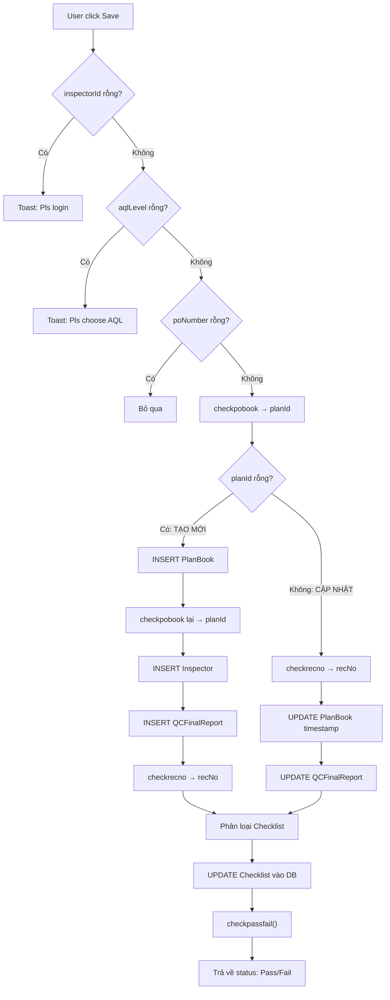

# Implementation Plan: Save All (Btnsaveall_Click → Web API)

> Chuyển đổi logic `Btnsaveall_Click` từ C# sang Java Spring Boot + React

---

## 1. Phân Tích Luồng C# Gốc (10 Bước)



---

## 2. Thiết Kế API Backend

### Endpoint: `POST /api/inspection/save-all`

**Request Body (JSON):**
```json
{
  "poNumber": "0902104135",
  "factory": "F1",
  "inspectorId": "thanhle_cfa",
  "planRef": "548523175451",
  "aqlLevel": "Regular orders (AQL 1.0, Level I)",
  "sampleSize": "50",
  "totalQty": "3000",
  "insQty": "50",
  "cartonNum": "1|6|12|18|25|28|35|42|45|51|55|59|66",
  "checklistConform": "0|1|2|3|4|5|6|7|8|9|10|11|12|13|14|15|16|17|18|19|20|21|22|23|24|25|26",
  "checklistNonConform": "",
  "checklistNA": "7|9"
}
```

**Response:**
```json
{
  "code": 200,
  "data": {
    "success": true,
    "planId": "12345",
    "recNo": "59126",
    "isNew": false,
    "status": "P",
    "message": "Saved successfully"
  }
}
```

---

## 3. Logic Backend Chi Tiết (InspectionService.saveAll)

### Bước 1: Validation
- inspectorId, aqlLevel, poNumber phải không rỗng

### Bước 2: Check PlanBook tồn tại
```sql
exec DtradeProduction.dbo.QCFinal 'checkpobook', @poNumber, @factory, @inspectorId, @planRef, '', ''
```
→ Trả về `planId`

### Bước 3a: Nếu planId RỖNG (Tạo mới)
```sql
-- INSERT PlanBook
INSERT INTO DtradeProduction.dbo.InlineFGsWHPlanBook 
  (Factory, PONo, ShipNo, AQLPlan, AQLSample, AQLCTN, Status, CreatedBy, SysCreateDate, PlanDate, JobNo) 
VALUES (@factory, @poNumber, '1', @aqlLevel, @sampleSize, @cartonCount, 'Book', @inspectorId, getdate(), getdate(), @planRef)

-- Lấy lại planId
exec DtradeProduction.dbo.QCFinal 'checkpobook', @poNumber, @factory, @inspectorId, @planRef, '', ''

-- INSERT Inspector
INSERT INTO DtradeProduction.dbo.InlineFGsWHInspector (PlanID, Inspector, InsQty) VALUES (@planId, @inspectorId, @totalQty)

-- INSERT Report
INSERT INTO DtradeProduction.dbo.QCFinalReport 
  (PlanID, InsDate, Inspector, CartonNum, InsQTY, Accpected, Rejected, SysCreateDate) 
VALUES (@planId, getdate(), @inspectorId, @cartonNum, @insQty, @insQty, '0', getdate())

-- Lấy recNo
exec DtradeProduction.dbo.QCFinal 'checkrecno', @planId, @inspectorId, '', '', '', ''
```

### Bước 3b: Nếu planId ĐÃ CÓ (Cập nhật)
```sql
-- Lấy recNo
exec DtradeProduction.dbo.QCFinal 'checkrecno', @planId, @inspectorId, '', '', '', ''

-- Update timestamp
UPDATE DtradeProduction.dbo.InlineFGsWHPlanBook SET SysCreateDate = getdate() WHERE PlanID = @planId

-- Update report (GIỮ NGUYÊN logic C# gốc: Accepted = InsQTY)
UPDATE DtradeProduction.dbo.QCFinalReport 
SET InsDate = getdate(), InsQTY = @insQty, Accpected = @insQty 
WHERE RecNo = @recNo
```

> [!NOTE]
> Giữ nguyên logic C# gốc `Accpected = insQty` để đảm bảo tương thích. Bug này đã có từ C# và cần fix riêng nếu cần.

### Bước 4: Phân loại Checklist
Từ `checklistConform` (danh sách index dạng `"0|1|2|..."`)
- Index < 9 → `generalList` (cộng thêm 1)
- Index > 8 && < 11 → `cartonList` (trừ 7) — hiện không lưu DB
- Index > 9 → `checkList` (trừ 9)

### Bước 5: Lưu Checklist
```sql
UPDATE DtradeProduction.dbo.QCFinalReport 
SET GeneralList = @generalList, CheckList = @checkList, 
    Measurment = @checklistConform, SupplierSignature = @checklistNonConform, 
    ProductionStatus = @checklistNA
WHERE RecNo = @recNo
```

### Bước 6: Check Pass/Fail
```sql
exec QCFinal 'updatestatus', @poNumber, '', '', '', '', ''
SELECT Status FROM DtradeProduction.dbo.InlineFGsWHPlanBook WHERE PlanID = @planId
```

---

## 4. Thay Đổi Frontend

### 4.1. Thêm API method
```typescript
// inspection_api.ts
export const saveAll_api = (data: SaveAllRequest) => {
    return request({
        url: '/api/inspection/save-all',
        method: 'POST',
        data: data,
    });
};
```

### 4.2. Cập nhật nút SAVE trong PageInspection.tsx
- Khi click SAVE → gom dữ liệu từ `useAppStore` (poInfo, checklistStatuses)
- Gọi `saveAll_api(payload)`
- Nhận lại `planId`, `recNo`, `status`
- Cập nhật `poInfo` trong store với giá trị mới
- Hiển thị toast Pass (xanh) hoặc Fail (đỏ)

### 4.3. Dữ liệu cần thu thập từ Store
| Trường | Nguồn |
|:---|:---|
| poNumber | `poInfo.poNumber` |
| factory | `useAppStore.factory` |
| inspectorId | `poInfo.inspectorId` |
| planRef | `poInfo.planRefNo` |
| aqlLevel | `poInfo.aqllv` (cần thêm vào store) |
| sampleSize | `poInfo.sampleSize` |
| totalQty | `poInfo.totalQty` |
| insQty | Input field trên form |
| cartonNum | Từ carton numbers section |
| checklistConform/NonConform/NA | `useAppStore.checklistStatuses` |

---

## 5. Checklist Triển Khai

- [ ] **Backend:** Thêm `saveAll()` method vào `InspectionService.java`
- [ ] **Backend:** Thêm `POST /api/inspection/save-all` endpoint vào `InspectionController.java`
- [ ] **Frontend:** Thêm `saveAll_api()` vào `inspection_api.ts`
- [ ] **Frontend:** Cập nhật `handleSpeedDialAction('SAVE')` trong `PageInspection.tsx`
- [ ] **Frontend:** Đảm bảo `poInfo` có đủ field `aqllv`, `insQty`, `cartonNum`
- [ ] **Test:** Verify tạo mới PO lần đầu (INSERT flow)
- [ ] **Test:** Verify update PO đã có (UPDATE flow)
- [ ] **Test:** Verify checklist lưu đúng format
- [ ] **Test:** Verify Pass/Fail status trả về đúng
