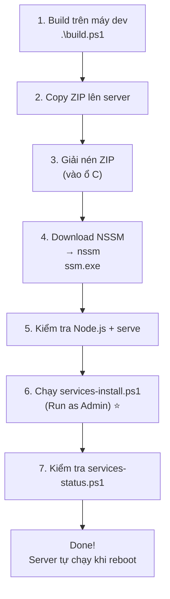

# Hướng Dẫn Triển Khai QCFinal Windows Services

## Tổng Quan Các File Mới

| File | Mục đích |
|---|---|
| [services-install.ps1](file:///d:/QCFinal_Web/services-install.ps1) | Cài đặt 2 Windows Services + Firewall + Task Scheduler |
| [services-uninstall.ps1](file:///d:/QCFinal_Web/services-uninstall.ps1) | Gỡ bỏ hoàn toàn services |
| [services-status.ps1](file:///d:/QCFinal_Web/services-status.ps1) | Kiểm tra trạng thái nhanh |
| [services-rotate-logs.ps1](file:///d:/QCFinal_Web/services-rotate-logs.ps1) | Dọn log cũ (>30 ngày), tự động mỗi đêm |
| [services-logback-spring.xml](file:///d:/QCFinal_Web/services-logback-spring.xml) | Cấu hình log theo ngày cho Backend |

> [!IMPORTANT]
> `build.ps1` đã được cập nhật — khi build sẽ **tự động đóng gói** cả 5 file `services-*` và thư mục `logs\` vào ZIP.

---

## Quy Trình Triển Khai



---

### Bước 1: Build trên máy dev

```powershell
cd D:\QCFinal_Web
.\build.ps1
```

File `QCFinal-release.zip` sẽ chứa sẵn:

```
QCFinal-release\
├── backend\
│   └── *.jar, application.properties, custom-java.security
├── frontend\
│   └── index.html, assets\...
├── jre\
│   └── bin\java.exe
├── logs\                              ← TẠO SẴN
│   ├── backend\                       ← Backend log ghi vào đây
│   ├── frontend\                      ← Frontend log ghi vào đây
│   └── README.txt
├── services-install.ps1               ← TỰ ĐÓNG GÓI
├── services-uninstall.ps1             ← TỰ ĐÓNG GÓI
├── services-status.ps1                ← TỰ ĐÓNG GÓI
├── services-rotate-logs.ps1           ← TỰ ĐÓNG GÓI
├── services-logback-spring.xml        ← TỰ ĐÓNG GÓI
├── start.ps1                          (chạy manual, giữ nguyên)
├── start-backend.ps1
└── start-frontend.ps1
```

### Bước 2: Copy ZIP lên server + giải nén

```
Giải nén vào ví dụ: C:\QCFinal\
```

### Bước 3: Download NSSM

1. Truy cập **https://nssm.cc/download**
2. Download bản **nssm 2.24**
3. Đặt `nssm.exe` vào:

```
C:\QCFinal\
└── nssm\
    └── nssm.exe
```

> [!TIP]
> Nếu giải nén nguyên thư mục NSSM, cấu trúc `nssm\win64\nssm.exe` cũng được — script tự detect.

### Bước 4: Kiểm tra Node.js + serve trên server

```powershell
node --version          # Cần có Node.js
npm install -g serve    # Cài serve nếu chưa có
```

### Bước 5: Chạy services-install.ps1 ⭐

```powershell
# Click phải → Run as Administrator
cd C:\QCFinal
powershell -ExecutionPolicy Bypass -File .\services-install.ps1
```

Script tự động thực hiện:
1. ✅ Kiểm tra tất cả prerequisites
2. ✅ Đăng ký **QCFinal-Backend** (Auto Start, port 6664)
3. ✅ Đăng ký **QCFinal-Frontend** (Auto Start, port 7780)
4. ✅ Mở Firewall
5. ✅ Tạo Task Scheduler dọn log mỗi đêm
6. ✅ Khởi động cả 2 services

### Bước 6: Kiểm tra

```powershell
.\services-status.ps1
```

Hoặc mở `services.msc` → tìm:
- **QCFinal Backend API (Port 6664)** → Running
- **QCFinal Frontend Web (Port 7780)** → Running

---

## Quản Lý Sau Cài Đặt

| Thao tác | Cách thực hiện |
|---|---|
| Xem trạng thái | `.\services-status.ps1` hoặc `services.msc` |
| Restart Backend | `services.msc` → QCFinal-Backend → Restart |
| Xem log Backend | Mở `logs\backend\backend-current.log` |
| Xem log Frontend | Mở `logs\frontend\frontend.log` |
| Gỡ hoàn toàn | `.\services-uninstall.ps1` (Run as Admin) |
| Quay lại manual | Gỡ services → dùng `start.ps1` |

> [!CAUTION]
> **Không chạy `start.ps1` song song với services!** Sẽ bị trùng port 6664/7780.

---

## Quy Trình Cập Nhật (Update) Bản Mới

Khi có thay đổi code và cần đẩy lên server, bạn **không cần cài lại Service**. Hãy làm theo các bước sau:

1. **Build bản mới** trên máy dev (`.\build.ps1`)
2. **Copy ZIP** lên server.
3. **Stop Services đang chạy** (Quan trọng! Nếu không stop, Windows sẽ không cho ghi đè file `.jar` vì đang được sử dụng):
   - Mở `services.msc`, tìm `QCFinal-Backend` và `QCFinal-Frontend`, nhấn chuột phải chọn **Stop**.
   - HOẶC mở PowerShell (Admin) và chạy: 
     ```powershell
     Stop-Service QCFinal-Backend
     Stop-Service QCFinal-Frontend
     ```
4. **Giải nén file ZIP mới**, copy đè thư mục `backend\` và `frontend\` vào thư mục đang chạy (ví dụ `C:\QCFinal\QCFinal-release\`).
5. **Start Services trở lại**:
   - Mở `services.msc`, tìm `QCFinal-Backend` và `QCFinal-Frontend`, nhấn chuột phải chọn **Start**.
   - HOẶC chạy PowerShell (Admin):
     ```powershell
     Start-Service QCFinal-Backend
     Start-Service QCFinal-Frontend
     ```
