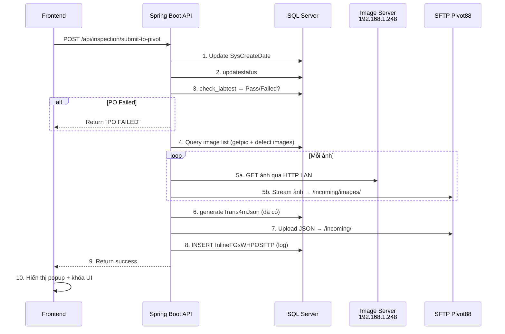

# 📋 Kế Hoạch Triển Khai: Submit to SFTP (Pivot88/TRANS4M)

> **Mục tiêu**: Khi user click nút **Submit**, hệ thống sẽ upload toàn bộ ảnh + file JSON lên SFTP server Pivot88, lưu log vào DB, và khóa giao diện.

> [!IMPORTANT]
> Phần **tạo file JSON** (`generateTrans4mJson`) đã hoàn thành. Plan này chỉ tập trung vào **upload SFTP** và **orchestration**.

---

## Tổng Quan Luồng Xử Lý



---

## Thứ Tự Triển Khai Theo Từng Bước

---

### BƯỚC 1: Thêm Dependency JSch vào `pom.xml`

Thêm thư viện SFTP client cho Java:

```xml
<!-- SFTP Client (JSch) -->
<dependency>
    <groupId>com.github.mwiede</groupId>
    <artifactId>jsch</artifactId>
    <version>0.2.18</version>
</dependency>
```

> [!NOTE]
> Sử dụng fork `com.github.mwiede:jsch` thay vì `com.jcraft:jsch` cũ vì bản gốc đã ngưng maintain và không hỗ trợ các thuật toán SSH mới.

---

### BƯỚC 2: Thêm Cấu Hình SFTP vào `application.properties`

```properties
# ─── SFTP Pivot88 ─────────────────────────────────────────────────
# Credentials được load từ DB (GetLoadData 651 - Tables[1])
# Các giá trị dưới đây là fallback, ưu tiên đọc từ DB
sftp.pivot88.buffer-size=10240
sftp.pivot88.connect-timeout=30000
sftp.pivot88.remote-path-json=/incoming/
sftp.pivot88.remote-path-images=/incoming/images/

# ─── Image Server (LAN) ──────────────────────────────────────────
image.server.base-path=ImageQCFINAL/
```

> [!IMPORTANT]
> Credentials SFTP (IP, Port, User, Password) được load **động từ DB** thông qua `GetLoadData 651` → `Tables[1]`, tương tự C# `loadserver()`. KHÔNG hardcode.

---

### BƯỚC 3: Tạo `SftpService.java` — Service Upload SFTP

**File**: `backend/src/main/java/com/trax/sampleroomdigital/service/SftpService.java`

**Chức năng chính**:

| Method | Mô tả |
|--------|-------|
| `loadSftpCredentials()` | Đọc SFTP credentials từ DB (`GetLoadData 651` → Tables[1]) |
| `uploadImageStream(InputStream, remoteFileName)` | Upload 1 ảnh lên `/incoming/images/` |
| `uploadJsonStream(InputStream, remoteFileName)` | Upload JSON lên `/incoming/` |
| `uploadFile(InputStream, remotePath)` | Low-level upload với JSch |

**Logic chi tiết**:

```java
@Service
public class SftpService {

    private final JdbcTemplate jdbcTemplate;
    
    // Cached credentials (loaded from DB)
    private String sftpHost;
    private int sftpPort;
    private String sftpUser;
    private String sftpPassword;
    private boolean credentialsLoaded = false;

    /**
     * Load SFTP credentials from DB.
     * C# equivalent: loadserver() → dsServer.Tables[1]
     * Columns: EmployeeName=IP, EmployeeCode=User, Password=Pw, Section=Port
     */
    public void loadSftpCredentials() { ... }

    /**
     * Upload a single file via SFTP.
     * C# equivalent: UpSFTPImage(nm, url, type)
     * - type=1 → /incoming/images/
     * - type=0 → /incoming/
     * Buffer size = 10KB (same as C#: client.BufferSize = 10 * 1024)
     */
    public void uploadFile(InputStream inputStream, String remotePath) { ... }
}
```

> [!TIP]
> **Tối ưu so với C#**: Mỗi lần upload không mở/đóng connection mới. Sử dụng **1 session SFTP** cho toàn bộ batch upload (tất cả ảnh + JSON) trong 1 lần submit.

---

### BƯỚC 4: Tạo `SubmitService.java` — Orchestrator Logic

**File**: `backend/src/main/java/com/trax/sampleroomdigital/service/SubmitService.java`

Đây là service chính điều phối toàn bộ luồng submit, tương đương `Btnsubmit2_Click` + `CreateJSonFileAQLoutbound_Trans4m_CTQ` trong C#.

#### 4.1 — Validation & Pre-check

```java
/**
 * BƯỚC 1: Validate trước khi submit
 * C# equivalent lines 490-516:
 *   - Check recNo != ""
 *   - Update SysCreateDate
 *   - Call updatestatus
 *   - Call check_labtest → nếu "Failed" thì dừng
 */
private void validateAndPreCheck(String recNo, String poNumber) {
    // 1. Update SysCreateDate
    //    C#: CSDL.Doc("update QCFinalReport set SysCreateDate=getdate() where RecNo=" + recno)
    jdbcTemplate.update("UPDATE QCFinalReport SET SysCreateDate=getdate() WHERE RecNo=?", recNo);

    // 2. Update status
    //    C#: CSDL.Ghi("DtradeProduction.dbo.QCFinal 'updatestatus','" + edsearchpo.Text + "'...")
    jdbcTemplate.execute("EXEC DtradeProduction.dbo.QCFinal 'updatestatus','" + poNumber + "','','','','',''");

    // 3. Check labtest
    //    C#: CSDL.Doc("DtradeProduction.dbo.QCFinal 'check_labtest','" + edsearchpo.Text + "'...")
    List<Map<String,Object>> labResult = jdbcTemplate.queryForList(
        "EXEC DtradeProduction.dbo.QCFinal 'check_labtest',?,'','','','',''", poNumber);
    
    if (!labResult.isEmpty() && "Failed".equals(labResult.get(0).get("result").toString())) {
        throw new RuntimeException("PO FAILED");
    }
}
```

#### 4.2 — Thu Thập Danh Sách Ảnh Cần Upload

```java
/**
 * BƯỚC 2: Collect tất cả ảnh cần upload
 * 
 * Nguồn ảnh (giống C# CreateJSonFileAQLoutbound_Trans4m_CTQ):
 *   A. Overview pictures: getpic → RecNo → field "Image"
 *   B. Defect pictures: dtTotal → field "Image1" (per DefectCode)
 * 
 * Format tên file upload: [Unikey].[originalName].[extension]
 * C# equivalent: DownloadImageandUpload() → newnm = id + "." + nmNew + "." + duoiNew
 */
private List<ImageUploadTask> collectImageTasks(String recNo, String poNumber, String planRef) {
    List<ImageUploadTask> tasks = new ArrayList<>();
    
    // A. Overview pictures (getpic)
    // B. Defect pictures (from dtTotal per DefectCode)
    // → Mỗi ảnh tạo 1 ImageUploadTask {sourceUrl, remoteFileName}
    
    return tasks;
}
```

**DTO `ImageUploadTask`**:

```java
class ImageUploadTask {
    String sourceHttpUrl;    // http://192.168.1.248/ImageQCFINAL/filename.jpg
    String remoteFileName;   // [Unikey].[name].[ext] → upload lên /incoming/images/
}
```

#### 4.3 — Upload Ảnh (Ảnh PHẢI lên trước JSON!)

```java
/**
 * BƯỚC 3: Upload tất cả ảnh lên SFTP /incoming/images/
 * 
 * Tối ưu Web: Spring Boot Backend GET ảnh trực tiếp qua LAN từ 192.168.1.248
 * rồi stream thẳng sang SFTP. KHÔNG cần lưu file local.
 * 
 * C# equivalent: DownloadImageandUpload() → DownloadImage() → UpSFTPImage(nm, url, 1)
 */
private int uploadAllImages(List<ImageUploadTask> tasks, SftpService sftpService) {
    int successCount = 0;
    for (ImageUploadTask task : tasks) {
        // 1. HTTP GET ảnh từ image server (LAN)
        //    C#: WebClient.DownloadFile(uri, filePath)
        InputStream imageStream = new URL(task.sourceHttpUrl).openStream();
        
        // 2. Stream thẳng lên SFTP
        //    C#: UpSFTPImage(newnm, folderPath + "/", 1) → /incoming/images/
        sftpService.uploadImageStream(imageStream, task.remoteFileName);
        
        successCount++;
        // Không cần File.Delete() vì không lưu file local!
    }
    return successCount;
}
```

> [!TIP]
> **Khác biệt quan trọng với C#**: App C# phải Download ảnh về tablet → Upload lên SFTP → Delete local file. Spring Boot **stream trực tiếp** từ Image Server → SFTP qua LAN nội bộ, nhanh hơn nhiều.

#### 4.4 — Sinh JSON & Upload JSON

```java
/**
 * BƯỚC 4: Generate JSON + Upload lên SFTP /incoming/
 * 
 * C# equivalent:
 *   - CreateJSonFileAQLoutbound_Trans4m_CTQ() → serialize JSON
 *   - StreamWriter → ghi file local
 *   - UpSFTPImage(nm, dirPath, 0) → upload /incoming/
 * 
 * Tối ưu Web: Convert JSON String → InputStream → SFTP trực tiếp
 * KHÔNG cần ghi file .json xuống disk
 */
private String uploadJson(String poNumber, String planRef, String recNo, SftpService sftpService) {
    // 1. Generate JSON (method đã có sẵn!)
    String jsonPayload = inspectionService.generateTrans4mJson(poNumber, planRef, recNo);
    
    // 2. Tạo tên file: JsonTest_AQLOutbound_[PO]_[Timestamp].json
    String fileName = "JsonTest_AQLOutbound_" + poNumber + "_" 
        + new SimpleDateFormat("yyyyMMddHHmmss").format(new Date()) + ".json";
    
    // 3. Upload trực tiếp (không cần ghi file local)
    InputStream jsonStream = new ByteArrayInputStream(jsonPayload.getBytes(StandardCharsets.UTF_8));
    sftpService.uploadJsonStream(jsonStream, fileName);
    
    return fileName;
}
```

> [!WARNING]
> **Thứ tự QUAN TRỌNG**: Ảnh phải upload TRƯỚC, JSON upload SAU. Pivot88 đọc JSON → tìm ảnh tham chiếu. Nếu ảnh chưa có sẽ báo lỗi!

#### 4.5 — Lưu Log & Return

```java
/**
 * BƯỚC 5: Lưu lịch sử submit vào DB
 * C# equivalent line 889:
 *   INSERT INTO InlineFGsWHPOSFTP(PONo, FileName, CreatedBy, SysCreateDate, PlanRef)
 *   VALUES(...)
 */
private void saveSubmitLog(String poNumber, String fileName, String inspectorId, String planRef) {
    String sql = "INSERT INTO InlineFGsWHPOSFTP(PONo, FileName, CreatedBy, SysCreateDate, PlanRef) " +
                 "VALUES (?, ?, ?, getdate(), ?)";
    jdbcTemplate.update(sql, poNumber, fileName, inspectorId, planRef);
}
```

---

### BƯỚC 5: Tạo API Endpoint trong `InspectionController.java`

```java
/**
 * POST /api/inspection/submit-to-pivot
 * 
 * Request Body:
 * {
 *   "poNumber": "0902104135",
 *   "planRef": "JOB-001",
 *   "recNo": "12345",
 *   "inspectorId": "EMP001"
 * }
 * 
 * Response (success):
 * {
 *   "success": true,
 *   "message": "Submitted COMPLETE...",
 *   "fileName": "JsonTest_AQLOutbound_0902104135_20260507.json",
 *   "imagesUploaded": 15
 * }
 */
@PostMapping("/submit-to-pivot")
public ApiResponse<Map<String, Object>> submitToPivot(
    @RequestBody Map<String, String> body) {
    // Gọi SubmitService.submitToPivot(...)
}
```

---

### BƯỚC 6: Frontend — Gọi API Submit & Xử Lý UI

#### 6.1 — Gọi API khi click Submit

```typescript
async function handleSubmitToPivot() {
    // 1. Confirm dialog
    if (!confirm('Bạn có chắc chắn muốn Submit lên Pivot88?')) return;
    
    // 2. Show loading overlay
    showLoadingOverlay('Đang submit lên Pivot88...');
    
    // 3. Call API
    const response = await fetch('/api/v2/api/inspection/submit-to-pivot', {
        method: 'POST',
        headers: { 'Content-Type': 'application/json', 'Authorization': 'Bearer ' + token },
        body: JSON.stringify({ poNumber, planRef, recNo, inspectorId })
    });
    
    // 4. Handle response
    const data = await response.json();
    if (data.data.success) {
        showSuccessPopup('Submitted COMPLETE...');
        disableSubmitButtons();  // Khóa giao diện
    } else {
        showErrorPopup(data.data.message);
    }
}
```

#### 6.2 — Khóa UI sau khi Submit thành công

```typescript
// C# equivalent: btnsave.SetTextColor(Color.Black); lvdef.Adapter = null;
function disableSubmitButtons() {
    // Disable tất cả nút save/submit
    // Đổi màu nút thành xám
    // Ngăn submit lại
}
```

---

## Tổng Hợp File Cần Tạo/Sửa

| # | File | Action | Mô tả |
|---|------|--------|-------|
| 1 | `pom.xml` | **EDIT** | Thêm dependency JSch |
| 2 | `application.properties` | **EDIT** | Thêm config SFTP paths |
| 3 | `SftpService.java` | **NEW** | Service upload file lên SFTP |
| 4 | `SubmitService.java` | **NEW** | Orchestrator logic submit |
| 5 | `InspectionController.java` | **EDIT** | Thêm endpoint `submit-to-pivot` |
| 6 | Frontend JS/TS | **EDIT** | Gọi API submit + xử lý UI |

---

## Mapping C# → Java (Tham Chiếu Nhanh)

| C# (Legacy) | Java (Web) | Ghi chú |
|---|---|---|
| `SftpClient` (Renci.SshNet) | `JSch` (com.github.mwiede) | Thư viện SFTP |
| `UpSFTPImage(nm, url, 0)` | `sftpService.uploadJsonStream()` | Upload JSON → `/incoming/` |
| `UpSFTPImage(nm, url, 1)` | `sftpService.uploadImageStream()` | Upload ảnh → `/incoming/images/` |
| `DownloadImageandUpload()` | Stream trực tiếp (HTTP GET → SFTP PUT) | Không cần lưu local |
| `WebClient.DownloadFile()` | `new URL(...).openStream()` | Lấy ảnh từ image server |
| `File.Delete()` | Không cần | Vì không lưu file local |
| `loadserver()` → `Pv88Ip/Port/User/Pw` | `sftpService.loadSftpCredentials()` | Load từ `GetLoadData 651` Tables[1] |
| `check_labtest` | `validateAndPreCheck()` | Pre-check trước submit |
| `INSERT InlineFGsWHPOSFTP` | `saveSubmitLog()` | Lưu lịch sử submit |
| `client.BufferSize = 10 * 1024` | `channel.put(stream, remote, monitor, 0)` | JSch tự quản lý buffer |

---

## Xử Lý Lỗi (Error Handling)

| Lỗi | Xử lý |
|-----|-------|
| SFTP connection failed | Retry 2 lần, sau đó trả lỗi cho frontend |
| Image download failed (1 ảnh) | Log warning, tiếp tục upload ảnh còn lại |
| JSON upload failed | **Nghiêm trọng** — trả lỗi, KHÔNG insert log |
| check_labtest → "Failed" | Trả "PO FAILED", DỪNG toàn bộ flow |
| recNo rỗng | Trả lỗi "Error... Pls choose PO" |

---

## Checklist Triển Khai

- [ ] **Bước 1**: Thêm JSch dependency vào `pom.xml`
- [ ] **Bước 2**: Thêm config SFTP vào `application.properties`
- [ ] **Bước 3**: Tạo `SftpService.java` (load credentials + upload)
- [ ] **Bước 4**: Tạo `SubmitService.java` (orchestrate flow)
- [ ] **Bước 5**: Thêm endpoint `POST /submit-to-pivot` vào Controller
- [ ] **Bước 6**: Frontend gọi API + xử lý UI
- [ ] **Bước 7**: Test end-to-end (image upload + JSON upload + DB log)
